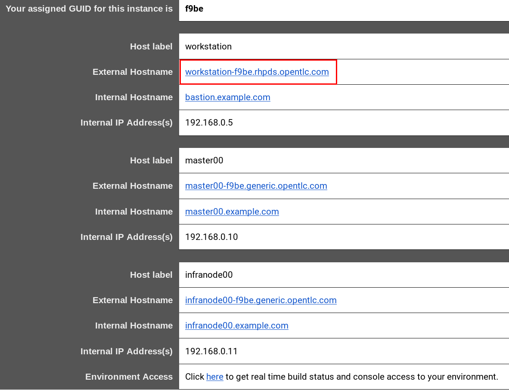
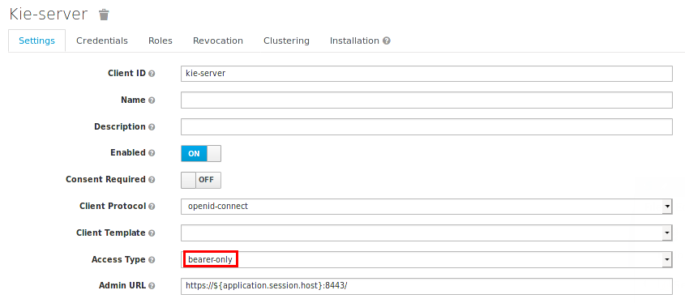

:noaudio:
:scrollbar:
:data-uri:
:toc2:
:linkattrs:

= Lab Setup

.Prerequisites
.. The `ssh` utility installed on your laptop.
+
NOTE: If your network connection is intermittent, consider installing the https://mosh.org/[mosh] utility (`yum install mosh`) as an alternative to the `ssh` utility.

.. Web browser installed on your laptop.
.. Broadband internet connectivity.
.. link:https://account.opentlc.com/account/[Red Hat GPTE _Opentlc_ userId]

:numbered:

== Overview

=== Background

=== Deployment Topology

image::images/arch_topology.png[]

== Course Virtual Machine

Your lab environment is remote and consists of the following:

. *OpenShift Container Platform* (OCP)  
. *Red Hat Process Automation Manager* (RH-PAM) 
. *Red Hat Single Sign-On* (RH-SSO)

This lab environment is accessible can also be accessed via ssh.

=== Order Virtual Machine
This section guides you through the procedure to order a virtual machine (VM) for this course.

==== Access VM via OPENTLC or RHSE

NOTE: [blue]#This section is applicable if you are an existing student of either Red Hat's _Open Partner Enablement Network (OPEN)_ or Skills Exchange (RHSE) programs.#

. In a web browser, navigate to the _Cloud Forms_ environment for OPEN and RHSE at:   https://labs.opentlc.com.
. Authenticate using your _OPENTLC_ credentials, for example: `johndoe-redhat.com`.
. Navigate to the following catalog:  `Services -> Catalog -> Catalog Items -> OPENTLC Middleware Solutions Labs`.
. Select the following catalog item: `RHTE_2019: Dynamic Case Mgmt`.
. Click `Order` on the next page.

. In the subsequent order form, select the check box confirming you understand the runtime and expiration dates. :
. At the bottom of the same page, click `Submit`.

/////
==== Access VM via GUID Grabber

NOTE: [blue]#This section is only applicable if you are a participant in a Red Hat conference such as Red Hat Tech Exchange (RHTE)#.

This section of the lab explains how to access the Red Hat Tech Exchange _GuidGrabber_ to obtain a Globally Unique Identifier (GUID).
This GUID will be used to access a virtual machine that you will use in this course.

. In a web browser, navigate to: http://bit.ly/rhte-guidgrabber.

. Select the *Lab Code* :  `A1004 - Dynamic Case Mgmt`.

. Enter the *Activation Key* provided to you by your instructor.

. Click `Next`.

. The resulting page will display your lab's GUID and other useful information about your lab environment.
+
image::images/guid_grabber_response.png[Guid Grabber Information Page]

. Your remote virtual machine is accessible via the `SSH` protocol.
+
Follow the directions exactly as indicated in the Guid Grabber Information Page to log into your remote lab VM via SSH.

. When you are finished with your lab environment at the end of this course, please click *Reset Workstation* so that you can move on to the next lab.
If you fail to do this, you will be locked into the GUID from the previous lab.
+
[NOTE]
Clicking *Reset Workstation* will not stop or delete the lab environment.
/////

=== Confirmation Emails

Upon ordering the lab environment, you will receive the following two emails:

. *Your lab environment is building*
.. Save this email.
.. This email Includes details of the three VMs that make up your lab application similar to the following:
+

.. Make note of the 4 digit GUID (aka: REGION CODE)
+
* Whenever you see "GUID" or "$GUID" in a command, make sure to replace it with your GUID.

.. Make note of the URL of the `workstation` VM.
+
You will use this when ssh'ing to your application.

.. Make note of the URL of the `master` VM.
+
You will use this when accessing the OCP Web Console.

** The OpenShift master URL varies based on the region where you are located, and may vary from the example shown above.
** For the duration of the course, you navigate to this OpenShift Container Platform master node.

. *VM ready for authentication*
+
Once you receive this second email, you can then ssh into the `workstation` VM of your Ravello application.

=== SSH Access and `oc` utility

SSH access to the remote lab environment provides you with the OpenShift `oc` utility.

. ssh access to your lab environment by specifying your _opentlc userId_ and lab environment $GUID in the following command:
+
-----
$ ssh <opentlc-userId>@workstation-$GUID.rhpds.opentlc.com
-----

. Authenticate into OpenShift as a non cluster admin user (user1) using the `oc` utility
+ 
-----
$ oc login https://master00.example.com -u user1 -p r3dh4t1!
-----

. OCP cluster admin access
+
OCP cluster admin access is provided by switching to the root operating system of your lab environment as follows.
+
-----
$ sudo -i

# oc login -u system:admin      # NOTE: This command is typically not needed
                                #       /root/.kube/config already contains the _system:admin_ user's token

# exit
-----

=== Refresh Process Automation Manager state

Your Process Automation Manager needs to be refreshed with the URL of the Red Hat SSO specific to your lab environment.
For this purpose, a script has been provided as follows: 

. Gain OCP cluster access via the shell of the root operating system user:
+
-----
$ sudo -i
-----

. Execute the following:
+
-----

# mkdir -p $HOME/lab && \
       wget https://bit.ly/2ItoCid -O $HOME/lab/pam_rhsso_state_update.sh \
       && chmod 755 $HOME/lab/pam_rhsso_state_update.sh \
       && $HOME/lab/pam_rhsso_state_update.sh 5dff
-----

. You should see a response similar to the following:
+
-----
will update the following stale guid in the Process Automation Manager: 5dff

deploymentconfig.apps.openshift.io/rhpam-kieserver updated
deploymentconfig.apps.openshift.io/rhpam-bc updated

-----
+
If you are curious as to what exactly is getting modified in the Process Automation Manager, you can review link:https://bit.ly/2ItoCid[the script].
+
In particular, notice that the wildcard DNS of RH-SSO URLs used in the Process Automation Manager are modified.

. After a couple of minutes, expect two of the three RH-PAM pods to have re-started:
+
-----
$ oc get pods -n rhpam-dev-user1

rhpam-bc-3-rvwtn           1/1       Running   1          2m
rhpam-kieserver-4-5f97q    1/1       Running   0          2m
rhpam-postgresql-1-nks5f   1/1       Running   1          20h
-----

. Provider the OCP user called _user1_ with the ability to impersonate cluster admin:
+
-----
# oc adm policy add-cluster-role-to-user sudoer user1
-----

. Exit out of the root operating system user shell:
+
-----
# exit
-----
+
[blue]#Make sure to exit out of the root shell after every use#

[[env_vars]]
== Environment Variables

The instructions in this course require use of environment variables.
Now that you have a lab environment, in this section, you set these environment variables in your remote client environment.

. As the non-root operating system user of your remote VM, execute the following commands:
+
-----
echo "export OCP_USERNAME=user1" >> ~/.bashrc
echo 'export OCP_PASSWD=r3dh4t1!' >> ~/.bashrc

echo "export OCP_REGION=`echo $HOSTNAME | cut -d'.' -f1 | cut -d'-' -f2`" >> ~/.bashrc
echo "export OCP_DOMAIN=\$OCP_REGION.generic.opentlc.com" >> ~/.bashrc
echo "export OCP_WILDCARD_DOMAIN=apps-\$OCP_DOMAIN" >> ~/.bashrc
echo "export rhsso_url=sso-rhsso-sso0.\$OCP_WILDCARD_DOMAIN" >> ~/.bashrc
echo "export bc_url=rhpam-bc-rhpam-dev-\$OCP_USERNAME.\$OCP_WILDCARD_DOMAIN" >> ~/.bashrc
echo "export web_app_url=TODO.\$OCP_WILDCARD_DOMAIN" >> ~/.bashrc

echo "export RHPAM_PROJECT=rhpam-dev-\$OCP_USERNAME" >> ~/.bashrc
echo "export RHPAM_TOOLS_PROJECT=pam-7-tools-\$OCP_USERNAME" >> ~/.bashrc
echo "export RHSSO_PROJECT=rhsso_sso0" >> ~/.bashrc
echo "export WEBAPP_PROJECT=TODO" >> ~/.bashrc

source ~/.bashrc
-----

. Create a directory to store files related to this lab:
+
-----
$ mkdir -p $HOME/lab
-----

== OpenShift Container Platform

Your lab environment is built on Red Hat's OpenShift Container Platform (OCP).

Access to your OCP resources can be gained via both the `oc` CLI utility and the OCP web console.

. Validate the ability to _impersonate_ cluster admin:
+
-----
$ oc get nodes --as=system:admin

NAME                      STATUS    ROLES            AGE       VERSION
infranode00.example.com   Ready     infra            4d        v1.11.0+d4cacc0
master00.example.com      Ready     compute,master   4d        v1.11.0+d4cacc0
-----
+
For the purpose of this lab, the cluster-admin of your OCP environment has provided you with the ability to _impersonate_ the _cluster-admin_.
You would not have had the ability to execute the above command (by specifying `--as=system:admin`) if the cluster-admin had not already done so.
In the next lab you will use this ability to impersonate the cluster admin.

. View details of the ClusterQuota that the _cluster-admin_ has assigned to your OpenShift user:
+
-----
$ oc describe clusterquota quota-rhpam-$OCP_USERNAME --as=system:admin

....

Resource                Used    Hard
--------                ----    ----
configmaps              1       15
limits.cpu              4100m   9
limits.memory           8904Mi  16Gi
persistentvolumeclaims  4       10
pods                    5       20
requests.cpu            750m    4
requests.memory         3160Mi  8Gi
requests.storage        9Gi     40Gi
secrets                 23      50
services                5       50
-----

. Provide _user1_ with view access to the namespace where Red Hat SSO is installed:
+
-----
$ oc adm policy add-role-to-user view user1 -n rhsso-sso0 --as=system:admin
-----

. View existing projects:
+
-----
$ oc get projects

...

pam-7-tools-user1   Tools          Active
rhpam-dev-user1     RHPAM-dev      Active
rhsso-sso0                         Active
-----

. *pam-7-tools-user1*
+
This OCP project contains a _Nexus_ server as well as a web tool to execute administrative tasks on the PostgreSQL database used by the RH-PAM kie-server.

. *rhpam-dev-user1*
+
This OCP project contains both the RH-PAM Business Central and KIE-Server applications.
+
Both of these applications are secured using the OpenID Connect protocol via an integration with a Red Hat SSO server.

. *rhsso-sso0*
+
This OCP project contains the RH-SSO application that secures the RH_PAM Business Central and KIE-Server.

=== OCP Web Console

. Point your browser to the URL created by executing the following :
+
-----
$ echo -en "\nhttps://master00-$OCP_REGION.generic.opentlc.com\n\n"
-----

. Authenticate using the following user credentials
.. Username:    user1
.. Password:    r3dh4t1!

== RH-SSO
TODO:  Elaborate on purpose

. Log into the pre-configured _kie-realm_:
+
-----
$ echo -en "\n\nhttps://$rhsso_url/auth/admin/kie-realm/console\n\n"
-----

. Authenticate using the following credentials:  admin / admin1234
+
image::images/sso_login_home.png[]

=== SSO Clients
In this section of the lab, you view pre-existing SSO clients and modify one of them (the _business-central_ SSO Client).

. In the left panel, navigate to:  `Clients`.
. Notice the existence of two SSO Clients of importance for this lab: _kie-server_ and _business-central_.

. *kie-server*
+
_Bearer-only_ client leveraged by the KIE-Server
+

. *business-central*
+
_Authorization Code_ flow client leveraged by the Business Central web application.
+
You will need to add a _redirect_uri_ of your Business Central web application to this SSO Client.  Do so as follows:

.. TODO

=== Users
. View pre-configured users
.. In the left panel, navigate to: `Users -> View all users`.
.. The following table provides details of each pre-configured user:
+
[cols="1,1,5",options="header"]
|==============================
|Username|Password|Description
|adminuser|admin1!|Admin user assigned to the roles: Administrators, admin, kie-server, kiemgmt, rest-all
|controlleruser|controller1!|Used by kie-server when accessing KIE controller embedded in Business Central
|casemanager|r3dh4t1!|
|casesupplier|r3dh4t1!|
|caseuser|r3dh4t1!|
|Super|Password1!|TODO
|Ava|Password1!|TODO
|Bill|Password1!|TODO
|Tina|Password1!|TODO
|Tom|Password1!|TODO
|Eve|Password1!|TODO
|Ann|Password1!|TODO
|Bob|Password1!|TODO
|==============================

== Process Automation Manager

Your lab environment includes a 3scale API Manager with one tenant.
The API Manager functionality operates in the namespace:  _$API_MANAGER_NS_.

=== RH-PAM resources

. Review RH-PAM DeploymentConfigs:
+
-----
$ oc get dc -n $RHPAM_PROJECT

...

NAME              REVISION   DESIRED   CURRENT   TRIGGERED BY
rhpam-bc           4          1         1         config,image(rhpam73-businesscentral-openshift:1.1-3)
rhpam-kieserver    5          1         1         config,image(rhpam73-kieserver-openshift:1.1-3)
rhpam-postgresql   1          1         1         config,image(postgresql:9.6)
-----

. Review running pods:
+
-----
$ oc get pods -n $RHPAM_PROJECT

...

NAME                          READY     STATUS      RESTARTS   AGE
rhpam-bc-4-cs6l4           1/1       Running   0          1h
rhpam-kieserver-5-cpmxb    1/1       Running   0          1h
rhpam-postgresql-1-nks5f   1/1       Running   2          23h

...
-----

=== Validate Integration with RH-SSO

The Business Central and KIE-Server components of RH-PAM are secured by integrating with a RH-SSO server using the OpenID Connect Protocol (OIDC).
You can verify this via the logs of both RH-PAM applications.

. View log statements regarding SSO integration in Business Central:
+
-----
$ oc logs `oc get pod -n $RHPAM_PROJECT | grep "rhpam-bc" | awk '{print $1}'` -n $RHPAM_PROJECT | head -n 15 

...

INFO Obtained auth token from https://sso-rhsso-sso0.apps-af16.generic.opentlc.com/auth for realm kie-realm
WARN ERROR: Unable to register openid-connect client for module root in realm kie-realm on : {"errorMessage":"Client business-central already exists"}
INFO Configured keycloak subsystem for openid-connect module root from ROOT.war
-----
+
The log statements above allude to an integration with an SSO _realm_ called: _kie-realm_ using an SSO _client_ called:  _business-central_.
This _business-central_ SSO client comes pre-configured to implement the _Authorization Code_ flow of OIDC.

. View log statements regarding SSO integration in KIE-Server:
+
-----
$ oc logs `oc get pod -n $RHPAM_PROJECT | grep "rhpam-kieserver" | awk '{print $1}'` -n $RHPAM_PROJECT | head -n 15 

...

INFO Obtained auth token from https://sso-rhsso-sso0.apps-af16.generic.opentlc.com/auth for realm kie-realm
WARN ERROR: Unable to register openid-connect client for module root in realm kie-realm on : {"errorMessage":"Client kie-server already exists"}
INFO Configured keycloak subsystem for openid-connect module root from ROOT.war
-----
+
The log statements above allude to an integration with an SSO _realm_ called: _kie-realm_ using an SSO _client_ called:  _kie-server_.
This _business-central_ SSO client is of type _bearer-only_.

=== Access Business Central

For the purpose of this lab, you will serve as the administrator of your own RH-PAM Business Central.

Log into the administration portal of your Business Central web app as follows:

. Point your browser to the URL of your Business Central web app as provided in the output of the following command:
+
-----
$ echo -en "\n\nhttps://$bc_url\n\n"
-----

. Authenticate using:  adminuser / admin1! 
+
image::images/bc_login_home.png[]

[blue]#Congratulations!#
Your lab environment is now ready to use.  Please proceed to the next lab:  link:TODO[*TODO*]

== Appendix

=== Optional:  Lab Environment Provisioning
This section provides an overview of the ansible used to provision your own lab environment.

It is offered to those that are interested in provisioning an environment to support this lab using their own resources.

The lab environment assumes an existing OCP 3.11 installation with cluster admin access and about 24GB of RAM.

The lab environment can be provisioned via the following Ansible roles:

. https://github.com/gpe-mw-ansible-org/rh-sso-multi-realm
+
TODO

. https://github.com/gpe-mw-ansible-org/rhpam-dev-ansible
+
TODO

. Additional notes as follows

.. In RH-SSO, change the _kie-server_ SSO client to a _bearer-only_ client

ifdef::showscript[]

endif::showscript[]
