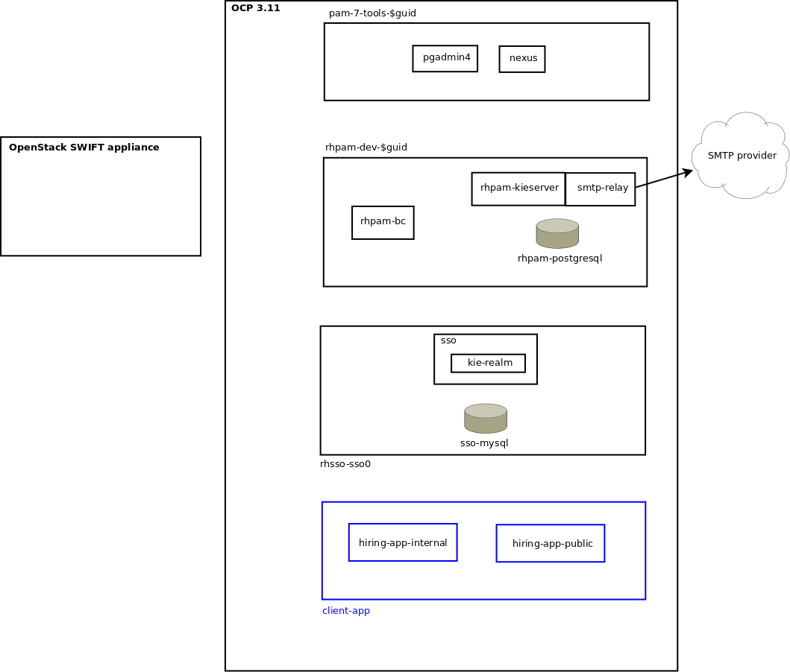
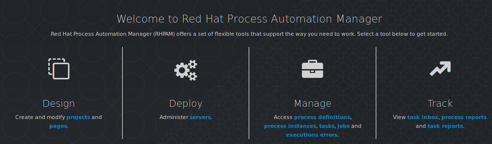
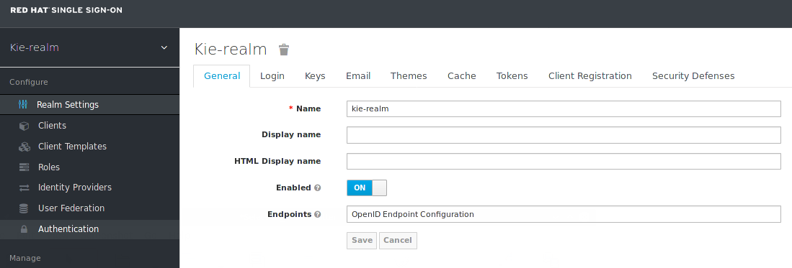

:noaudio:
:scrollbar:
:data-uri:
:toc2:
:linkattrs:

// The following variable can be one of the following:
//   1) cf_order
//   2) guid_grabber
:lab_order_type: cf_order

= Lab Setup

.Prerequisites
.. The `ssh` utility installed on your laptop.
+
NOTE: If your network connection is intermittent, consider installing the https://mosh.org/[mosh] utility (`yum install mosh`) as an alternative to the `ssh` utility.

.. Web browser installed on your laptop.
.. Broadband internet connectivity.
.. link:https://account.opentlc.com/account/[Red Hat GPTE _Opentlc_ userId]

:numbered:

== Overview
In this workshop you will deploy, manage and develop a platform that assists with a hiring request business process. 
This business process consists of :

. Receiving a *Hiring Petition*
. Evaluation of the *Candidate skills* 
. Execution of other *Hiring requirements* to fulfill the *Job Position*.
. Job Offer Acceptance by the candidate

The scope of the solution is from the *Hiring Petition* to the *Job Offer Acceptance*.
In particular, any business processes after the *Candidate* has been selected is out of the scope of our current platform.


During the workshop, you will perform the following activities:

* Deploy and configure the most representative parts of the platform, paying attention to the bending and connection points of their infrastructure.
* Execute an end to end demo of the most common cases, specially the happy path.
* Analyze the client applications to find the integration points with the back end components.
* Modify one of the client applications to allow some dynamicity allowed by *Red Hat Process Automation Manager* when working with *Case Management* projects.

The scope of the workshop includes the analysis of an existing platform that integrates *Case Management* with modern Javascript frameworks like *ReactJs* over *NodeJs*. 

=== Background
This workshop is inspired in the original demo created in March 2019 (link:https://gitlab.consulting.redhat.com/uki-sa/pam-demo[PAM Demo]) by link:https://gitlab.consulting.redhat.com/bholmes[Ben Holmes] and his team. Thank you for the inspiration received by a well done project.

In this workshop we will see another example of this implementation with similar flows, but now using a more data-driven case management solution and a different UI approach based on ReactJs (instead of Angular).

=== Deployment Topology

The deployment topology of your _Dynamic Case Management_ solution will be as depicted below:



. `pam-7-tools-$guid` 
+
Consists of `pgadmin4` and `Nexus`. 
`pgadmin4` is a web tool used to navigate the databases used in this lab. 
`Nexus` is a online repository for binary Maven artifacts.

. `rhpam-dev-$guid` 
+
In the `RHPAM-DEV` namespace we have the Red Hat Process Automation Manager components for authoring, runtime, database and email.

. `rhsso-sso0` 
+
In the `RHSSO` namespace we have Red Hat SSO for authentication and authorization across our environment.

. `client-app` 
+
The `reactjs` based web application deployed in this namespace will be modified during the workshop to demonstrate its integration with RHPAM.


== Course Virtual Machine

Your lab environment is remote and can be accessed via ssh as well as through your local browser.


=== Order Virtual Machine
This section guides you through the procedure to order a virtual machine (VM) for this course.

include::{lab_order_type}.adoc[]

=== Refresh Process Automation Manager state

Your Process Automation Manager needs to be refreshed with the URL of the Red Hat SSO specific to your lab environment.
For this purpose, a script has been provided as follows:

. Change to the operating system root user with OCP cluster admin privledges:
+
-----
$ sudo -i
-----

. Execute the following refresh script:
+
-----

# mkdir -p $HOME/lab && \
       wget https://raw.githubusercontent.com/barhte2019/ansible-deployer/master/casemgmt_state_refresh.sh -O $HOME/lab/casemgmt_state_refresh.sh \
       && chmod 755 $HOME/lab/casemgmt_state_refresh.sh \
       && $HOME/lab/casemgmt_state_refresh.sh
-----

. You should see a response similar to the following:
+
-----
will update the following stale guid in the Process Automation Manager: da7e

Now using project "rhpam-dev-user1" on server "https://master00.example.com:443".
deploymentconfig.apps.openshift.io/rhpam-bc scaled
deploymentconfig.apps.openshift.io/rhpam-kieserver scaled
persistentvolumeclaim "rhpam-bc-claim" deleted
persistentvolumeclaim/rhpam-bc-claim created
deploymentconfig.apps.openshift.io/rhpam-bc patched
deploymentconfig.apps.openshift.io/rhpam-bc scaled

Pause for the following number of seconds: 15
deploymentconfig.apps.openshift.io/rhpam-kieserver patched
deploymentconfig.apps.openshift.io/rhpam-kieserver scaled
-----
+
If you are curious as to what exactly is getting modified in the Process Automation Manager, you can review link:https://raw.githubusercontent.com/barhte2019/ansible-deployer/master/casemgmt_state_refresh.sh[the script].
+
In particular, notice that the wildcard DNS of RH-SSO URLs used in the Process Automation Manager are modified.

. After a couple of minutes, expect two of the three RH-PAM pods to have re-started:
+
-----
$ oc get pods -n rhpam-dev-user1

rhpam-bc-3-rvwtn           1/1       Running   1          2m
rhpam-kieserver-4-5f97q    2/2       Running   0          2m
rhpam-postgresql-1-nks5f   1/1       Running   1          20h
-----

. Exit out of the root user
+
-----
# exit
-----

[[env_vars]]
== Environment Variables

The remaining instructions in this lab make use of environment variables.
In this section, you set these environment variables in your remote lab environment.


. In your remote lab environment, execute the following:
+
-----
$ mkdir -p $HOME/lab && \
       wget https://raw.githubusercontent.com/barhte2019/ansible-deployer/master/set_env_vars.sh -O $HOME/lab/set_env_vars.sh \
       && chmod 755 $HOME/lab/set_env_vars.sh \
       && $HOME/lab/set_env_vars.sh \
       && source $HOME/.bashrc
-----

. Review the environment variables that have been set:
+
-----
$ cat $HOME/.bashrc
-----

== OpenShift Container Platform

Your lab environment is built on Red Hat's OpenShift Container Platform (OCP).

Access to your OCP resources can be gained via both the `oc` CLI utility and the OCP web console.

. View existing projects:
+
-----
$ oc get projects

...

pam-7-tools-user1   Tools          Active
rhpam-dev-user1     RHPAM-dev      Active
rhsso-sso0                         Active
-----

. *pam-7-tools-user1*
+
This OCP project contains a _Nexus_ server as well as a web tool to execute administrative tasks on the PostgreSQL database used by the RH-PAM kie-server.

. *rhpam-dev-user1*
+
This OCP project contains both the RH-PAM Business Central and KIE-Server applications.
+
Both of these applications are secured using the OpenID Connect protocol via an integration with a Red Hat SSO server.

. *rhsso-sso0*
+
This OCP project contains an installation of Red Hat Single Sign-On (RH-SSO) pre-configured with a SSO _realm_ (called: kie-realm) used to secure both RH-PAM Business Central and KieServer.

=== OCP Web Console

. Point your browser to the URL created by executing the following :
+
-----
$ echo -en "\nhttps://master00-$OCP_REGION.generic.opentlc.com\n\n"
-----

. Authenticate using the following user credentials
.. Username:    user1
.. Password:    r3dh4t1!


== Process Automation Manager

Your lab environment includes a common authoring installation for Red Hat Process Automation Manager. 
The common Authoring installation includes: A database, Business Central and Kie Server.
Red Hat Process Automation Manager containers operate in the namespace:  _$RHPAM_PROJECT_.

=== RH-PAM resources

. Review RH-PAM DeploymentConfigs:
+
-----
$ oc get dc -n $RHPAM_PROJECT

...

NAME              REVISION   DESIRED   CURRENT   TRIGGERED BY
rhpam-bc           4          1         1         config,image(rhpam73-businesscentral-openshift:1.1-3)
rhpam-kieserver    5          1         1         config,image(rhpam73-kieserver-openshift:1.1-3)
rhpam-postgresql   1          1         1         config,image(postgresql:9.6)
-----

. Review running pods:
+
-----
$ oc get pods -n $RHPAM_PROJECT

...

NAME                          READY     STATUS      RESTARTS   AGE
rhpam-bc-4-cs6l4           1/1       Running   0          1h
rhpam-kieserver-5-cpmxb    1/1       Running   0          1h
rhpam-postgresql-1-nks5f   1/1       Running   2          23h

...
-----


=== Access Business Central

For the purpose of this lab, you will serve as the administrator of your own RH-PAM Business Central.

Log into the administration portal of your Business Central web app as follows:

. Point your browser to the URL of your Business Central web app as provided in the output of the following command:
+
-----
$ echo -en "\n\nhttps://$bc_url\n\n"
-----

. Authenticate using:  adminuser / admin1!
+



[blue]#Congratulations!#
Your lab environment is now ready to use.  Please proceed to the next lab.

== Appendix

=== Optional: Review RH-SSO

The lab environment includes a Red Hat SSO installation to manage the authentication and authorization across the solution.
In particular, RH-SSO will :

. Allow external users to register and track their job applications.
. Assist in the handling of the authorization of internal users to manage and track their hiring requests.
. Serve as the Identity Provider for Business Central, Kie-Server and the client applications.

In this section you will review the current configurations of the SSO realm called: _kie-realm_ :

. Log into the pre-configured _kie-realm_:
+
-----
$ echo -en "\n\nhttps://$rhsso_url/auth/admin/kie-realm/console\n\n"
-----

. Authenticate using the following credentials:  admin / admin1234
+


==== SSO Clients

. In the left panel, navigate to:  `Clients`.
. Notice the existence of two SSO Clients of importance for this lab: _kie-server_ and _business-central_.

. *kie-server*
+
SSO client leveraged by the KIE-Server.  Enabled with the following flows:

.. _Authorization Code_ flow client leveraged by the kie-server web application.

.. _Resource Owner Password Credentials_
+
Supports liveness and readiness probes of kie-server using the user: _adminUser_.

. *business-central*
+
SSO client leveraged by Business Central.  Enabled with the following flows:

.. _Authorization Code_ flow client leveraged by the Business Central web application.

.. _Resource Owner Password Credentials_
+
Supports liveness and readiness probes of kie-server using the user: _adminUser_.

==== View pre-configured users in *Red Hat SSO*

. In the left panel of _kie-realm_, navigate to: `Users -> View all users`.
. The following table is reference only.  The table provides details of each pre-configured user:
+
[cols="1,1,5",options="header"]
|==============================
|Username|Password|Description
|adminuser|admin1!|Admin user assigned to the roles: Administrators, admin, kie-server, kiemgmt, rest-all
|controlleruser|controller1!|Used by kie-server when accessing KIE controller embedded in Business Central
|casemanager|r3dh4t1!| Generic case manager user.
|casesupplier|r3dh4t1!| Generic case supplier user.
|caseuser|r3dh4t1!| Generic case user.
|Super|Password1!|An administrative user with access to all cases and tasks.
|Ava|Password1!|Ava is an out of the box applicant user type for our Hiring process. Ava is able to apply for jobs, she is not able to login to business central, but is able to login into the public client application.
|Bill|Password1!|Bill is an out of the box applicant user type for our Hiring process. Bill is able to apply for jobs, he is not able to login to business central, but is able to login into the public client application.
|Tina|Password1!|Tina is a `Talent-acquisition` user for our Hiring process. Tina is able to create hiring requests using the internal client application, although is not able to access business central.
|Tom|Password1!|Tom is a `Talent-acquisition` user for our Hiring process. Tom is able to create hiring requests using the internal client application, although is not able to access business central.
|Eve|Password1!|Eve is an `Interviewer` user for our hiring process. Eve is able to be assigned human tasks for interview and she is able to provide feedback, although is not able to login business central is able to login into the internal application to contribute in the interview process of the applicants.
|Ann|Password1!|Eve is an `Interviewer` user for our hiring process. Ann is able to be assigned human tasks for interview and she is able to provide feedback, although is not able to login business central is able to login into the internal application to contribute in the interview process of the applicants.
|Bob|Password1!|Eve is an `Interviewer` user for our hiring process. Bob is able to be assigned human tasks for interview and she is able to provide feedback, although is not able to login business central is able to login into the internal application to contribute in the interview process of the applicants.
|==============================


[[bc_rhsso]]
=== Optional: Validate integration between RH-PAM and RH-SSO
The Business Central and KIE-Server components of RH-PAM are secured by integrating with a RH-SSO server using the OpenID Connect Protocol (OIDC).
You can verify this via the logs of both RH-PAM applications.


. View log statements regarding SSO integration in Business Central:
+
-----
$ oc logs `oc get pod -n $RHPAM_PROJECT | grep "rhpam-bc" | awk '{print $1}'` -n $RHPAM_PROJECT | head -n 15 | grep rhsso

...

INFO Obtained auth token from https://sso-rhsso-sso0.apps-af16.generic.opentlc.com/auth for realm kie-realm
-----
+
The log statements above allude to an integration with an SSO _realm_ called: _kie-realm_ using an SSO _client_ called:  _business-central_.
This _business-central_ SSO client comes pre-configured to implement the _Authorization Code_ flow of OIDC.


. View log statements regarding SSO integration in KIE-Server:
+
-----
$ oc logs -c rhpam-kieserver `oc get pod -n $RHPAM_PROJECT | grep "rhpam-kieserver" | awk '{print $1}'` -n $RHPAM_PROJECT | head -n 15 | grep rhsso

...

INFO Obtained auth token from https://sso-rhsso-sso0.apps-be98.generic.opentlc.com/auth for realm kie-realm
-----
+
The log statements above allude to an integration with an SSO _realm_ called: _kie-realm_ using an SSO _client_ called:  _kie-server_.
This _business-central_ SSO client is of type _bearer-only_.

=== Optional: OCP cluster admin related tasks

. OCP cluster admin access is provided by switching to the root operating system of your lab environment as follows.
+
-----
$ sudo -i
-----

. Provider the OCP user called _user1_ with the ability to impersonate cluster admin:
+
-----
# oc adm policy add-cluster-role-to-user sudoer user1
-----

. Validate the ability to _impersonate_ cluster admin:
+
-----
$ oc get nodes --as=system:admin

NAME                      STATUS    ROLES            AGE       VERSION
infranode00.example.com   Ready     infra            4d        v1.11.0+d4cacc0
master00.example.com      Ready     compute,master   4d        v1.11.0+d4cacc0
-----

. View details of the ClusterQuota that the _cluster-admin_ has assigned to your OpenShift user:
+
-----
$ oc describe clusterquota quota-rhpam-$OCP_USERNAME --as=system:admin

....

Resource                Used    Hard
--------                ----    ----
configmaps              1       15
limits.cpu              4100m   9
limits.memory           8904Mi  16Gi
persistentvolumeclaims  4       10
pods                    5       20
requests.cpu            750m    4
requests.memory         3160Mi  8Gi
requests.storage        9Gi     40Gi
secrets                 23      50
services                5       50
-----

. Provide _user1_ with view access to the namespace where Red Hat SSO is installed:
+
-----
$ oc adm policy add-role-to-user view user1 -n rhsso-sso0 --as=system:admin
-----

=== Optional: Review Fuse Document Management Service
A Fuse Camel route has been built in order to support the storage of offer letters documents. 
The Fuse route uses an Openstack Swift backend for document storage and retreival. 

==== Openstack Swift document service [W.I.P]
Openstack Swift provides a REST-based object API for storage and retrieval of documents. 
Clients are authenticated using the X-Auth-Token method, where a userid and password is initially provided to obtain the token. 
Subsequently, the token is used by curl or programmatic clients to access the services.

==== Fuse Camel route for document management
The Fuse route exposes a REST API to the PAM process. 
This API provides 2 methods: a PUT and a GET to store and retrieve the document respectively. 
The Camel route makes uses of processors which allow the user to develop custom code (in this case in Java). 
The Apache HTTP client API is used within the processors to make get and put requests to the Openstack Swift API. 
The Swift-specific parameters such as host, username, password and container name are specified in a configmap and added to the namespace.


==== Optional: Review OpenStack _Swift_ node for Document Storage

One of the nodes in the environment you have ordered runs an Openstack Swift instance which provides object storage. A container is created in this environment which can store objects. In the lab, offer letters will be stored and retrieved from this storage using a Fuse route. In this section, you will verify that you have access to the Swift object store by running a few curl commands to test it. A cotnainer called TEST and a user called test has been pre-created with a password testing. You will obtain an OAuth token to access the object store API, using the user and password information provided.

. ssh into the workstation node
. Switch to root user using `sudo -i`
. ssh into the Swift node
+
-----
$ ssh swift.example.com
-----

Optional: Review 


=== Optional:  Lab Environment Provisioning
This section provides an overview of the ansible used to provision your own lab environment. 

. Look-up the IP and user information by viewing the /etc/swift/proxy.conf file on the Swift node.
+
-----
$ cat /etc/swift/proxy-server.conf
.....
[DEFAULT]
bind_ip = 192.168.0.20
bind_port = 8080
workers = 8
user = swift

# This is a sample used for functional tests in SAIO. Contains well-known
# passwords.
[filter:tempauth]
use = egg:swift#tempauth
user_admin_admin = ***** .admin .reseller_admin
user_test_tester = testing .admin
user_test2_tester2 = testing2 .admin
user_test_tester3 = testing3
user_test5_tester5 = testing5 service
....
-----

. Issue a swift command to obtain information on the container created for you.
+
-----
$ swift --info --debug  -A http://192.168.0.20:8080/auth/v1.0 -U test:tester -K testing list TEST

DEBUG:urllib3.connectionpool:Starting new HTTP connection (1): 192.168.0.20
DEBUG:urllib3.connectionpool:http://192.168.0.20:8080 "GET /auth/v1.0 HTTP/1.1" 200 0
DEBUG:swiftclient:REQ: curl -i http://192.168.0.20:8080/auth/v1.0 -X GET
DEBUG:swiftclient:RESP STATUS: 200 OK
......
-----

. Use the IP obtained in the swift command or from proxy.conf to issue a GET request to obtain the OAuth token
+
-----
$ curl -v -H 'X-Storage-User: test:tester' -H 'X-Storage-Pass: testing' http://192.168.0.20:8080/auth/v1.0

* About to connect() to 192.168.0.20 port 8080 (#0)
*   Trying 192.168.0.20...
* Connected to 192.168.0.20 (192.168.0.20) port 8080 (#0)
> GET /auth/v1.0 HTTP/1.1
> User-Agent: curl/7.29.0
> Host: 192.168.0.20:8080
> Accept: */*
> X-Storage-User: test:tester
> X-Storage-Pass: testing
>
< HTTP/1.1 200 OK
< X-Storage-Url: http://192.168.0.20:8080/v1/AUTH_test
< X-Auth-Token-Expires: 75389
< X-Auth-Token: AUTH_tkbca12e00c544400abe044fd7e4639c1b
< Content-Type: text/html; charset=UTF-8
< X-Storage-Token: AUTH_tkbca12e00c544400abe044fd7e4639c1b
< Content-Length: 0
< X-Trans-Id: txff48655287f6427cbcec7-005d1b8f94
< X-Openstack-Request-Id: txff48655287f6427cbcec7-005d1b8f94
< Date: Tue, 02 Jul 2019 17:08:36 GMT
<
-----

. Create a simple text file under the /tmp directory and issue curl PUT and GET commands to verify that the document can be saved and retrieved. Use the OAuth token output from the previous command here. The x-object-meta-mtime parameter is optional.
+
-----
$ curl -i http://192.168.0.20:8080/v1/AUTH_test/TEST/tmp/nandantestfile1 -T /tmp/nandantestfile1 -X PUT -H "Content-Length: 13" -H "x-object-meta-mtime: 1562086115.848627" -H "X-Auth-Token: AUTH_tkbca12e00c544400abe044fd7e4639c1b"
HTTP/1.1 100 Continue

HTTP/1.1 201 Created
Last-Modified: Tue, 02 Jul 2019 16:56:54 GMT
Content-Length: 0
Etag: a13413187c04bd0022037c783b1d4be4
Content-Type: text/html; charset=UTF-8
X-Trans-Id: tx84fee81b8f97400da889a-005d1b8cd5
X-Openstack-Request-Id: tx84fee81b8f97400da889a-005d1b8cd5
Date: Tue, 02 Jul 2019 16:56:53 GMT

[root@swift-repl ~]# curl -X GET -H "X-Auth-Token:AUTH_tkbca12e00c544400abe044fd7e4639c1b" -i http://192.168.0.20:8080/v1/AUTH_test/TEST/tmp/nandantestfile1
HTTP/1.1 200 OK
Content-Length: 13
Content-Type: application/octet-stream
Accept-Ranges: bytes
Last-Modified: Tue, 02 Jul 2019 16:56:54 GMT
Etag: a13413187c04bd0022037c783b1d4be4
X-Timestamp: 1562086613.61380
X-Object-Meta-Mtime: 1562086115.848627
X-Trans-Id: tx0054a426a3014ea2bf173-005d1b8cde
X-Openstack-Request-Id: tx0054a426a3014ea2bf173-005d1b8cde
Date: Tue, 02 Jul 2019 16:57:02 GMT

abcracadabra
-----

You have verified that in your environment you can access the Swift object storage and store and retrieve files.

==== Deployment of the Fuse Swift integration
A Fuse REST service is deployed in the Openshift environment to connect to the Openstack Swift node for document storage and retreival. This section explains how the Fuse service is deployed.

. Using `oc` client, login into your OpenShift envr
. Create a namespace for the application
+
----
$ oc new-project swift-integration
----

. Give the default systemaccount in the namespace cluster view permissions
+
----
$ oc adm policy add-role-to-user view -z default
----

. Create a file ``application.properties``` in a local directory
+
----
swift.host=swift.example.com:8080
swift.username=test:tester
swift.password=testing
swift.container=TEST
----
. Create a configmap ```swift-integration``` in the namespace
+
----
$ oc create configmap swift-integration --from-file=application.properties
----

. Deploy the application with the Fabric8 maven plugin:
+
----
$ mvn clean package fabric8:deploy -Popenshift
----

. Examine the OpenAPI specification of the API using the following curl command:
+
----
$ curl http://$APP_ROUTE_HOST/api-docs
----

. Create a local file under the /tmp directory and put an object in Swift:
+
----
$ curl -X PUT -T /tmp/swifttest.txt http://$APP_ROUTE_HOST/api/put?object=test/swifttest.txt
----

. Retrieve an object from Swift:
+
----
$ curl http://$APP_ROUTE_HOST/api/get?object=test/swifttest.txt
----

. Expect to see the contents of the object you inserted in the previous command to be echoes by the get request. You have verified that the Fuse service can successfully interact with the Swift node.


It is offered to those that are interested in provisioning an environment to support this lab using their own resources.

The lab environment assumes an existing OCP 3.11 installation with cluster admin access and about 24GB of RAM.

The lab environment can be provisioned via the following Ansible:

==== link:https://github.com/gpe-mw-ansible-org/rh-sso-multi-realm[rh-sso-multi-realm]

. login into your OCP lab environment as a cluster admin

. Determine rhsso_url environment variable:
+
-----
rhsso_url = https://sso-rhsso-sso0.apps-71b4.generic.opentlc.com
-----

. Log into _master realm_ of RH-SSO at the following URL:
+
-----
$ echo -en "$rhsso_url/auth/admin/master/console/"
-----

. Authenticate using credentials of:  master /master


==== link:https://github.com/gpe-mw-ansible-org/rhpam-dev-ansible[rhpam-dev-ansible]

-----
use_custom_pam=false
ocp_user=user1
use_cluster_quota=true
guid=$ocp_user
businesscentral_image_namespace=openshift
kieserver_image_namespace=openshift

ansible-playbook playbooks/rhpam_dev.yml\
    -e ocp_user=$ocp_user \
    -e guid=$guid \
    -e use_cluster_quota=$use_cluster_quota \
    -e kieserver_image_namespace=$kieserver_image_namespace \
    -e businesscentral_image_namespace=$businesscentral_image_namespace \
    -e use_custom_pam=$use_custom_pam \
    -e rhsso_url=$rhsso_url/auth \
    -e smtp_host=$smtp_host \
    -e smtp_port=$smtp_port \
    -e smtp_userid=$smtp_userid \
    -e smtp_passwd=$smtp_passwd
-----


. Study:
+
-----
$ https://github.com/jboss-container-images/jboss-eap-modules/blob/master/os-eap-sso/added/keycloak.sh
-----

-----
INFO Obtained auth token from https://sso-rhsso-sso0.apps-71b4.generic.opentlc.com/auth for realm kie-realm
INFO Registered openid-connect client for module root in realm kie-realm on
INFO Configured keycloak subsystem for openid-connect module root from ROOT.war
-----

. BC
.. https://rhpam-bc-rhpam-dev-user1.apps-71b4.generic.opentlc.com   :   adminUser / admin1!

. Additional notes as follows

.. In RH-SSO, change the _kie-server_ SSO client to a _bearer-only_ client

ifdef::showscript[]

ansible-playbook playbooks/rhpam_dev.yml    -e ocp_user=$ocp_user     -e guid=$guid     -e use_cluster_quota=$use_cluster_quota     -e kieserver_image_namespace=$kieserver_image_namespace     -e businesscentral_image_namespace=$businesscentral_image_namespace     -e use_custom_pam=$use_custom_pam     -e rhsso_url=https://$rhsso_url/auth     -e smtp_host=$smtp_host     -e smtp_port=$smtp_port     -e smtp_userid=$smtp_userid     -e smtp_passwd=$smtp_passwd -e configure_smtp_relay=true


oc delete all -l "service=rhpam-kieserver"

        - name: smtp-relay
          image: quay.io/rhtgptetraining/ocp-smtp-relay:1.0
          imagePullPolicy: Always
          resources:
            limits:
              cpu: 500m
              memory: 512Mi
          env:
          - name: MTP_RELAY
            value: "{{ smtp_host }}"
          - name: MTP_PORT
            value: "{{ smtp_port }}"
          - name: MTP_USER
            value: "{{ smtp_userid }}"
          - name: MTP_PASS
            value: "{{ smtp_passwd }}"
          ports:
          - name: smtp
            containerPort: 25
            protocol: TCP


endif::showscript[]
