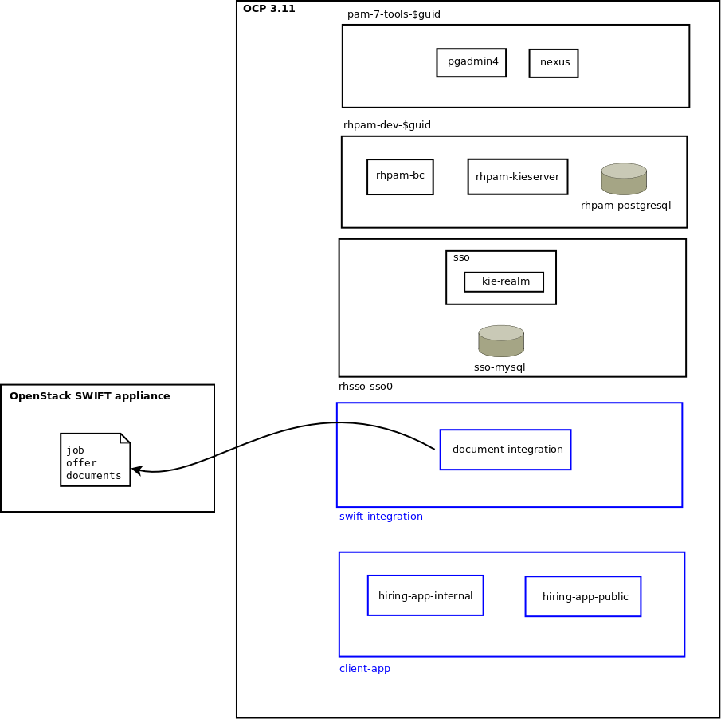
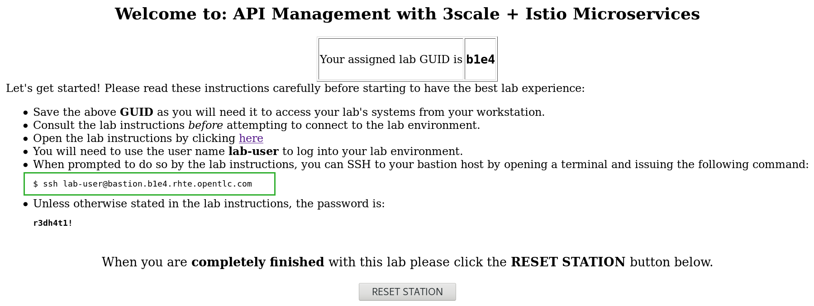
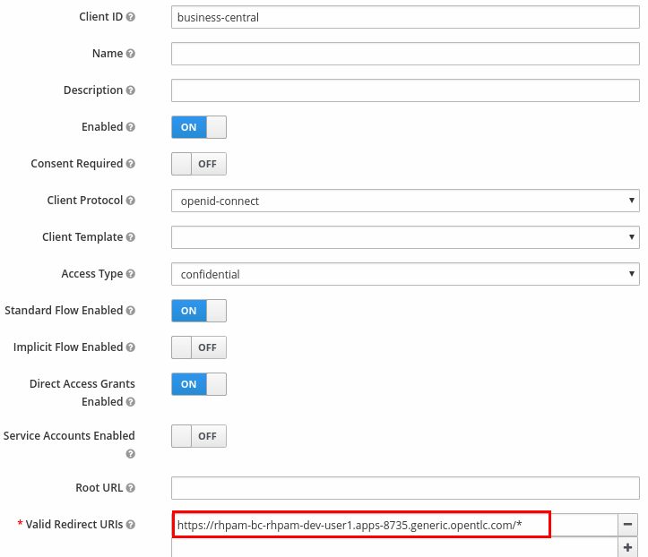

:noaudio:
:scrollbar:
:data-uri:
:toc2:
:linkattrs:

= Lab Setup

.Prerequisites
.. The `ssh` utility installed on your laptop.
+
NOTE: If your network connection is intermittent, consider installing the https://mosh.org/[mosh] utility (`yum install mosh`) as an alternative to the `ssh` utility.

.. Web browser installed on your laptop.
.. Broadband internet connectivity.
.. link:https://account.opentlc.com/account/[Red Hat GPTE _Opentlc_ userId]

:numbered:

== Overview
In this workshop you will deploy, manage and develop a platform that assists with the *Hiring request process*. 
The *Hiring request process* is the business process that consists of :

. Receiving a *Hiring Petition*
. Evaluation of the *Candidate skills* 
. Execution of other *Hiring requirements* to fulfill the *Job Position*.
. Job Offer Acceptance by the candidate

The scope of the solution is from the *Hiring Petition* to the *Job Offer Acceptance*.
In particular, any business processes after the *Candidate* has been selected is out of the scope of our current platform.

image::images/milestones-overview.png[Milestones Overview]

During the workshop, you will perform the following activities:

* Deploy and configure the most representative parts of the platform, paying attention to the bending and connection points of their infrastructure.
* Execute an end to end demo of the most common cases, specially the happy path.
* Analyze the client applications to find the integration points with the back end components.
* Modify one of the client applications to allow some dynamicity allowed by *Red Hat Process Automation Manager* when working with *Case Management* projects.

The scope of the workshop includes the analysis of an existing platform that integrates *Case Management* with modern Javascript frameworks like *ReactJs* over *NodeJs*. 

=== Background
This workshop is inspired in the original demo created in March 2019 (link:https://gitlab.consulting.redhat.com/uki-sa/pam-demo[PAM Demo]) by link:https://gitlab.consulting.redhat.com/bholmes[Ben Holmes] and his team. Thank you for the inspiration received by a well done project.

In this workshop we will see another example of this implementation with similar flows, but now using a more data-driven case management solution and a different UI approach based on ReactJs (instead of Angular).

=== Deployment Topology

The architecture of your _Dynamic Case Management_ solution will be as depicted below:

. `pam7-tools-$guid` 
+
Consists of `pgadmin4` and `Nexus`. 
`pgadmin4` is a web tool to navigate the databases used in the solution. 
`Nexus` is a online repository for binary Maven artifacts.

. `rhpam-dev-$guid` 
+
In the `RHPAM-DEV` namespace we have the Red Hat Process Automation Manager components for authoring, runtime, database and email.
. `rhsso-sso0` 
+
In the `RHSSO` namespace we have Red Hat SSO for authentication and authorization across our environment.

`client-app` 
+
The `reactjs` based web application deployed in this namespace will be modified during the workshop to demonstrate its integration with RHPAM.

== Course Virtual Machine

Your lab environment is remote and can be accessed via ssh as well as through your local browser.

=== Order Virtual Machine
This section guides you through the procedure to order a virtual machine (VM) for this course.

==== Access VM via OPENTLC or RHSE

NOTE: [blue]#This section is applicable if you are an existing student of either Red Hat's _Open Partner Enablement Network (OPEN)_ or Skills Exchange (RHSE) programs.#

. In a web browser, navigate to the _Cloud Forms_ environment for OPEN and RHSE at:   https://labs.opentlc.com.
. Authenticate using your _OPENTLC_ credentials, for example: `johndoe-redhat.com`.
. Navigate to the following catalog:  `Services -> Catalog -> Catalog Items -> OPENTLC Middleware Solutions Labs`.
. Select the following catalog item: `RHTE19: Dynamic Case Mgmt`.
. Click `Order` on the next page.

. In the subsequent order form, select the check box confirming you understand the runtime and expiration dates. :
. At the bottom of the same page, click `Submit`.

/////
==== Access VM via GUID Grabber

NOTE: [blue]#This section is only applicable if you are a participant in a Red Hat conference such as Red Hat Tech Exchange (RHTE)#.

This section of the lab explains how to access the Red Hat Tech Exchange _GuidGrabber_ to obtain a Globally Unique Identifier (GUID).
This GUID will be used to access a virtual machine that you will use in this course.

. In a web browser, navigate to: http://bit.ly/rhte-guidgrabber.

. Select the *Lab Code* :  `A1004 - Dynamic Case Mgmt`.

. Enter the *Activation Key* provided to you by your instructor.

. Click `Next`.

. The resulting page will display your lab's GUID and other useful information about your lab environment.
+

. Your remote virtual machine is accessible via the `SSH` protocol.
+
Follow the directions exactly as indicated in the Guid Grabber Information Page to log into your remote lab VM via SSH.

. When you are finished with your lab environment at the end of this course, please click *Reset Workstation* so that you can move on to the next lab.
If you fail to do this, you will be locked into the GUID from the previous lab.
+
[NOTE]
Clicking *Reset Workstation* will not stop or delete the lab environment.
/////

=== Confirmation Emails

Upon ordering the lab environment, you will receive the following two emails:

. *Your lab environment is building*
.. Save this email.
.. This email Includes details of the three VMs that make up your lab application similar to the following:
+
image::images/aio_first_email.png[]

.. Make note of the 4 digit GUID (aka: REGION CODE)
+
* Whenever you see "GUID" or "$GUID" in a command, make sure to replace it with your GUID.

.. Make note of the URL of the `workstation` VM.
+
You will use this when ssh'ing to your application.

.. Make note of the URL of the `master` VM.
+
You will use this when accessing the OCP Web Console.

** The OpenShift master URL varies based on the region where you are located, and may vary from the example shown above.
** For the duration of the course, you navigate to this OpenShift Container Platform master node.

. *VM ready for authentication*
+
Once you receive this second email, you can then ssh into the `workstation` VM of your Ravello application.

=== SSH Access and `oc` utility

SSH access to the remote lab environment provides you with the OpenShift `oc` utility.

. ssh access to your lab environment by specifying your _opentlc userId_ and lab environment $GUID in the following command:
+
-----
$ ssh <opentlc-userId>@workstation-$GUID.rhpds.opentlc.com
-----

. Authenticate into OpenShift as a non cluster admin user (user1) using the `oc` utility
+
-----
$ oc login https://master00.example.com -u user1 -p r3dh4t1!
-----

=== Refresh Process Automation Manager state

Your Process Automation Manager needs to be refreshed with the URL of the Red Hat SSO specific to your lab environment.
For this purpose, a script has been provided as follows:

. Execute the following:
+
-----

$ mkdir -p $HOME/lab && \
       wget https://bit.ly/2YhG0eA -O $HOME/lab/pam_rhsso_state_update.sh \
       && chmod 755 $HOME/lab/pam_rhsso_state_update.sh \
       && $HOME/lab/pam_rhsso_state_update.sh da7e
-----

. You should see a response similar to the following:
+
-----
will update the following stale guid in the Process Automation Manager: da7e

Now using project "rhpam-dev-user1" on server "https://master00.example.com:443".
deploymentconfig.apps.openshift.io/rhpam-bc scaled
deploymentconfig.apps.openshift.io/rhpam-kieserver scaled
persistentvolumeclaim "rhpam-bc-claim" deleted
persistentvolumeclaim/rhpam-bc-claim created
deploymentconfig.apps.openshift.io/rhpam-bc patched
deploymentconfig.apps.openshift.io/rhpam-bc scaled

Pause for the following number of seconds: 15
deploymentconfig.apps.openshift.io/rhpam-kieserver patched
deploymentconfig.apps.openshift.io/rhpam-kieserver scaled
-----
+
If you are curious as to what exactly is getting modified in the Process Automation Manager, you can review link:https://bit.ly/2YhG0eA[the script].
+
In particular, notice that the wildcard DNS of RH-SSO URLs used in the Process Automation Manager are modified.

. After a couple of minutes, expect two of the three RH-PAM pods to have re-started:
+
-----
$ oc get pods -n rhpam-dev-user1

rhpam-bc-3-rvwtn           1/1       Running   1          2m
rhpam-kieserver-4-5f97q    2/2       Running   0          2m
rhpam-postgresql-1-nks5f   1/1       Running   1          20h
-----

[[env_vars]]
== Environment Variables

The instructions in this course require use of environment variables.
Now that you have a lab environment, in this section, you set these environment variables in your remote client environment.

. As the non-root operating system user of your remote VM, execute the following commands:
+
-----
echo "export OCP_USERNAME=user1" >> ~/.bashrc
echo 'export OCP_PASSWD=r3dh4t1!' >> ~/.bashrc

echo "export OCP_REGION=`echo $HOSTNAME | cut -d'.' -f1 | cut -d'-' -f2`" >> ~/.bashrc
echo "export OCP_DOMAIN=\$OCP_REGION.generic.opentlc.com" >> ~/.bashrc
echo "export OCP_WILDCARD_DOMAIN=apps-\$OCP_DOMAIN" >> ~/.bashrc
echo "export rhsso_url=sso-rhsso-sso0.\$OCP_WILDCARD_DOMAIN" >> ~/.bashrc
echo "export bc_url=rhpam-bc-rhpam-dev-\$OCP_USERNAME.\$OCP_WILDCARD_DOMAIN" >> ~/.bashrc
echo "export ks_url=rhpam-kieserver-rhpam-dev-\$OCP_USERNAME.\$OCP_WILDCARD_DOMAIN" >> ~/.bashrc

echo "export RHPAM_PROJECT=rhpam-dev-\$OCP_USERNAME" >> ~/.bashrc
echo "export RHPAM_TOOLS_PROJECT=pam-7-tools-\$OCP_USERNAME" >> ~/.bashrc
echo "export RHSSO_PROJECT=rhsso_sso0" >> ~/.bashrc

source ~/.bashrc
-----

. Create a directory to store files related to this lab:
+
-----
$ mkdir -p $HOME/lab
-----

== OpenShift Container Platform

Your lab environment is built on Red Hat's OpenShift Container Platform (OCP).

Access to your OCP resources can be gained via both the `oc` CLI utility and the OCP web console.

. View existing projects:
+
-----
$ oc get projects

...

pam-7-tools-user1   Tools          Active
rhpam-dev-user1     RHPAM-dev      Active
-----

. *pam-7-tools-user1*
+
This OCP project contains a _Nexus_ server as well as a web tool to execute administrative tasks on the PostgreSQL database used by the RH-PAM kie-server.

. *rhpam-dev-user1*
+
This OCP project contains both the RH-PAM Business Central and KIE-Server applications.
+
Both of these applications are secured using the OpenID Connect protocol via an integration with a Red Hat SSO server.

=== OCP Web Console

. Point your browser to the URL created by executing the following :
+
-----
$ echo -en "\nhttps://master00-$OCP_REGION.generic.opentlc.com\n\n"
-----

. Authenticate using the following user credentials
.. Username:    user1
.. Password:    r3dh4t1!

== RH-SSO
We use Red Hat SSO to manage the authentication and authorization across our solution.
By using RH-SSO we will be able to allow external users to register and track their job applications, and we will also handle the authorization of internal users to manage and track their hiring requests.
Business Central, Kie-Server and the client applications will use Red Hat SSO to authenticate and authorize their operations.

In this section you will navigate the current configuration in your Red Hat SSO Realm:

. Log into the pre-configured _kie-realm_:
+
-----
$ echo -en "\n\nhttps://$rhsso_url/auth/admin/kie-realm/console\n\n"
-----

. Authenticate using the following credentials:  admin / admin1234
+
image::images/sso_login_home.png[]

=== SSO Clients
In this section of the lab, you view pre-existing SSO clients and modify one of them (the _business-central_ SSO Client).

. In the left panel, navigate to:  `Clients`.
. Notice the existence of two SSO Clients of importance for this lab: _kie-server_ and _business-central_.

. *kie-server*
+
SSO client leveraged by the KIE-Server.  Enabled with the following flows:

.. _Resource Owner Password Credentials_
+
Supports liveness and readiness probes of kie-server using the user: _adminUser_.

. *business-central*
+
_Authorization Code_ flow client leveraged by the Business Central web application.
+
You will need to add a _redirect_uri_ of your Business Central web application to this SSO Client.  Do so as follows:

.. Retrieve the remote URL for your business central from the ssh console by running:
+
----
$ echo -en "\n\nhttps://$bc_url/*\n\n"
----
.. *Edit* the `business-central` client in *Red Hat SSO* to specify the *Valid Redirect URIs* to the value retrieved in previous step; note the appending "/*" to the end of it. This means that all URIs sharing the same domain will be secured by this client.
+

.. *Save* the changes to the client

=== Users
. View pre-configured users in *Red Hat SSO*
.. In the left panel, navigate to: `Users -> View all users`.
.. The following table provides details of each pre-configured user:
+
[cols="1,1,5",options="header"]
|==============================
|Username|Password|Description
|adminuser|admin1!|Admin user assigned to the roles: Administrators, admin, kie-server, kiemgmt, rest-all
|controlleruser|controller1!|Used by kie-server when accessing KIE controller embedded in Business Central
|casemanager|r3dh4t1!| Generic case manager user.
|casesupplier|r3dh4t1!| Generic case supplier user.
|caseuser|r3dh4t1!| Generic case user.
|Super|Password1!|An administrative user with access to all cases and tasks.
|Ava|Password1!|Ava is an out of the box applicant user type for our Hiring process. Ava is able to apply for jobs, she is not able to login to business central, but is able to login into the public client application.
|Bill|Password1!|Bill is an out of the box applicant user type for our Hiring process. Bill is able to apply for jobs, he is not able to login to business central, but is able to login into the public client application.
|Tina|Password1!|Tina is a `Talent-acquisition` user for our Hiring process. Tina is able to create hiring requests using the internal client application, although is not able to access business central.
|Tom|Password1!|Tom is a `Talent-acquisition` user for our Hiring process. Tom is able to create hiring requests using the internal client application, although is not able to access business central.
|Eve|Password1!|Eve is an `Interviewer` user for our hiring process. Eve is able to be assigned human tasks for interview and she is able to provide feedback, although is not able to login business central is able to login into the internal application to contribute in the interview process of the applicants.
|Ann|Password1!|Eve is an `Interviewer` user for our hiring process. Ann is able to be assigned human tasks for interview and she is able to provide feedback, although is not able to login business central is able to login into the internal application to contribute in the interview process of the applicants.
|Bob|Password1!|Eve is an `Interviewer` user for our hiring process. Bob is able to be assigned human tasks for interview and she is able to provide feedback, although is not able to login business central is able to login into the internal application to contribute in the interview process of the applicants.
|==============================

== Process Automation Manager

Your lab environment includes a common authoring installation for Red Hat Process Automation Manager. 
The common Authoring installation includes: A database, Business Central and Kie Server.
Red Hat Process Automation Manager containers operate in the namespace:  _$RHPAM_PROJECT_.

=== RH-PAM resources

. Review RH-PAM DeploymentConfigs:
+
-----
$ oc get dc -n $RHPAM_PROJECT

...

NAME              REVISION   DESIRED   CURRENT   TRIGGERED BY
rhpam-bc           4          1         1         config,image(rhpam73-businesscentral-openshift:1.1-3)
rhpam-kieserver    5          1         1         config,image(rhpam73-kieserver-openshift:1.1-3)
rhpam-postgresql   1          1         1         config,image(postgresql:9.6)
-----

. Review running pods:
+
-----
$ oc get pods -n $RHPAM_PROJECT

...

NAME                          READY     STATUS      RESTARTS   AGE
rhpam-bc-4-cs6l4           1/1       Running   0          1h
rhpam-kieserver-5-cpmxb    1/1       Running   0          1h
rhpam-postgresql-1-nks5f   1/1       Running   2          23h

...
-----

=== Validate Integration with RH-SSO

The Business Central and KIE-Server components of RH-PAM are secured by integrating with a RH-SSO server using the OpenID Connect Protocol (OIDC).
You can verify this via the logs of both RH-PAM applications.

. View log statements regarding SSO integration in Business Central:
+
-----
$ oc logs `oc get pod -n $RHPAM_PROJECT | grep "rhpam-bc" | awk '{print $1}'` -n $RHPAM_PROJECT | head -n 15 | grep rhsso

...

INFO Obtained auth token from https://sso-rhsso-sso0.apps-af16.generic.opentlc.com/auth for realm kie-realm
-----
+
The log statements above allude to an integration with an SSO _realm_ called: _kie-realm_ using an SSO _client_ called:  _business-central_.
This _business-central_ SSO client comes pre-configured to implement the _Authorization Code_ flow of OIDC.

. View log statements regarding SSO integration in KIE-Server:
+
-----
$ oc logs -c rhpam-kieserver `oc get pod -n $RHPAM_PROJECT | grep "rhpam-kieserver" | awk '{print $1}'` -n $RHPAM_PROJECT | head -n 15 | grep rhsso

...

INFO Obtained auth token from https://sso-rhsso-sso0.apps-be98.generic.opentlc.com/auth for realm kie-realm
-----
+
The log statements above allude to an integration with an SSO _realm_ called: _kie-realm_ using an SSO _client_ called:  _kie-server_.
This _business-central_ SSO client is of type _bearer-only_.

=== Access Business Central

For the purpose of this lab, you will serve as the administrator of your own RH-PAM Business Central.

Log into the administration portal of your Business Central web app as follows:

. Point your browser to the URL of your Business Central web app as provided in the output of the following command:
+
-----
$ echo -en "\n\nhttps://$bc_url\n\n"
-----

. Authenticate using:  adminuser / admin1!
+
image::images/bc_login_home.png[]

[blue]#Congratulations!#
Your lab environment is now ready to use.  Please proceed to the next lab.

== Appendix

=== Optional: OCP cluster admin related tasks

. OCP cluster admin access is provided by switching to the root operating system of your lab environment as follows.
+
-----
$ sudo -i
-----

. Provider the OCP user called _user1_ with the ability to impersonate cluster admin:
+
-----
# oc adm policy add-cluster-role-to-user sudoer user1
-----

. Validate the ability to _impersonate_ cluster admin:
+
-----
$ oc get nodes --as=system:admin

NAME                      STATUS    ROLES            AGE       VERSION
infranode00.example.com   Ready     infra            4d        v1.11.0+d4cacc0
master00.example.com      Ready     compute,master   4d        v1.11.0+d4cacc0
-----

. View details of the ClusterQuota that the _cluster-admin_ has assigned to your OpenShift user:
+
-----
$ oc describe clusterquota quota-rhpam-$OCP_USERNAME --as=system:admin

....

Resource                Used    Hard
--------                ----    ----
configmaps              1       15
limits.cpu              4100m   9
limits.memory           8904Mi  16Gi
persistentvolumeclaims  4       10
pods                    5       20
requests.cpu            750m    4
requests.memory         3160Mi  8Gi
requests.storage        9Gi     40Gi
secrets                 23      50
services                5       50
-----

. Provide _user1_ with view access to the namespace where Red Hat SSO is installed:
+
-----
$ oc adm policy add-role-to-user view user1 -n rhsso-sso0 --as=system:admin
-----

=== Optional:  Lab Environment Provisioning
This section provides an overview of the ansible used to provision your own lab environment.

It is offered to those that are interested in provisioning an environment to support this lab using their own resources.

The lab environment assumes an existing OCP 3.11 installation with cluster admin access and about 24GB of RAM.

The lab environment can be provisioned via the following Ansible:

==== link:https://github.com/gpe-mw-ansible-org/rh-sso-multi-realm[rh-sso-multi-realm]

. login into your OCP lab environment as a cluster admin

. Determine rhsso_url environment variable:
+
-----
rhsso_url = https://sso-rhsso-sso0.apps-71b4.generic.opentlc.com
-----

. Log into _master realm_ of RH-SSO at the following URL:
+
-----
$ echo -en "$rhsso_url/auth/admin/master/console/"
-----

. Authenticate using credentials of:  master /master

==== link:https://github.com/gpe-mw-ansible-org/rhpam-dev-ansible[rhpam-dev-ansible]

-----
use_custom_pam=false
ocp_user=user1
use_cluster_quota=true
guid=$ocp_user
businesscentral_image_namespace=openshift
kieserver_image_namespace=openshift

ansible-playbook playbooks/rhpam_dev.yml\
    -e ocp_user=$ocp_user \
    -e guid=$guid \
    -e use_cluster_quota=$use_cluster_quota \
    -e kieserver_image_namespace=$kieserver_image_namespace \
    -e businesscentral_image_namespace=$businesscentral_image_namespace \
    -e use_custom_pam=$use_custom_pam \
    -e rhsso_url=$rhsso_url/auth \
    -e smtp_host=$smtp_host \
    -e smtp_port=$smtp_port \
    -e smtp_userid=$smtp_userid \
    -e smtp_passwd=$smtp_passwd
-----

. Study:
+
-----
$ https://github.com/jboss-container-images/jboss-eap-modules/blob/master/os-eap-sso/added/keycloak.sh
-----

-----
INFO Obtained auth token from https://sso-rhsso-sso0.apps-71b4.generic.opentlc.com/auth for realm kie-realm
INFO Registered openid-connect client for module root in realm kie-realm on
INFO Configured keycloak subsystem for openid-connect module root from ROOT.war
-----

. BC
.. https://rhpam-bc-rhpam-dev-user1.apps-71b4.generic.opentlc.com   :   adminUser / admin1!

. Additional notes as follows

.. In RH-SSO, change the _kie-server_ SSO client to a _bearer-only_ client

ifdef::showscript[]

ansible-playbook playbooks/rhpam_dev.yml    -e ocp_user=$ocp_user     -e guid=$guid     -e use_cluster_quota=$use_cluster_quota     -e kieserver_image_namespace=$kieserver_image_namespace     -e businesscentral_image_namespace=$businesscentral_image_namespace     -e use_custom_pam=$use_custom_pam     -e rhsso_url=https://$rhsso_url/auth     -e smtp_host=$smtp_host     -e smtp_port=$smtp_port     -e smtp_userid=$smtp_userid     -e smtp_passwd=$smtp_passwd -e configure_smtp_relay=true

oc delete all -l "service=rhpam-kieserver"

        - name: smtp-relay
          image: quay.io/rhtgptetraining/ocp-smtp-relay:1.0
          imagePullPolicy: Always
          resources:
            limits:
              cpu: 500m
              memory: 512Mi
          env:
          - name: MTP_RELAY
            value: "{{ smtp_host }}"
          - name: MTP_PORT
            value: "{{ smtp_port }}"
          - name: MTP_USER
            value: "{{ smtp_userid }}"
          - name: MTP_PASS
            value: "{{ smtp_passwd }}"
          ports:
          - name: smtp
            containerPort: 25
            protocol: TCP

endif::showscript[]
