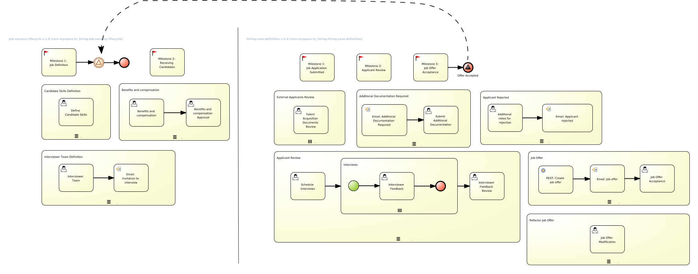

:noaudio:
:scrollbar:
:data-uri:
:toc2:
:linkattrs:

= Lab Setup

.Prerequisites
.. Execute Setup Lab.
.. Web browser installed on your laptop.
.. Broadband internet connectivity.
.. link:https://account.opentlc.com/account/[Red Hat GPTE _Opentlc_ userId]

:numbered:

== Overview
In this lab we will run the end-to-end cases for candidate selection and interviews in the hiring process, acting as different administrative users and as an applicant to experiment the usage of the platform.

=== Background
One of the departments in our organization wants to hire a new person, so the department raises a hiring petition, which is evaluated for the candidate requisites, interviewer team and compensation; once the job details are defined, the job is automatically posted in the *JOB FINDER* web site, so candidates can start applying for jobs; when a candidate applies the interviewer team can be scheduled and candidate evaluation begins; once a candidate is selected a job offer is generated and the candidate can accept the job offer to complete the case management up to this point.

=== Case Management Diagrams

== Department request for jobs
== HR define job requirements
== Candidate Apply for jobs
== The interview Process
== Job offer acceptance
