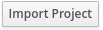
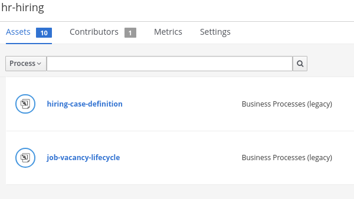
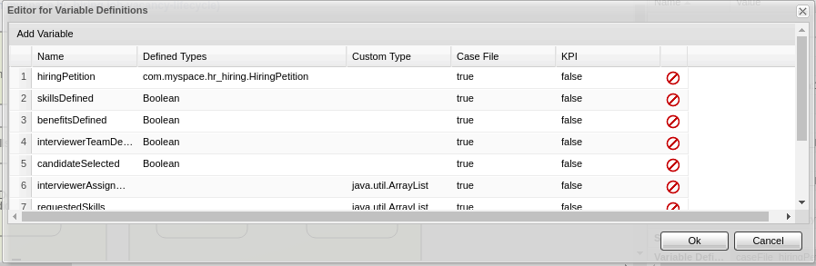
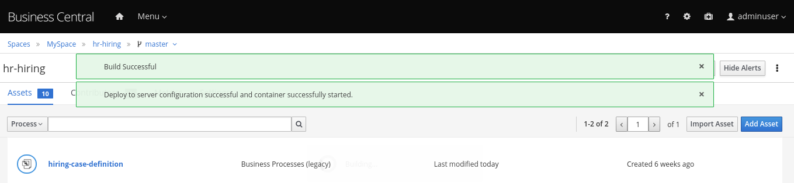
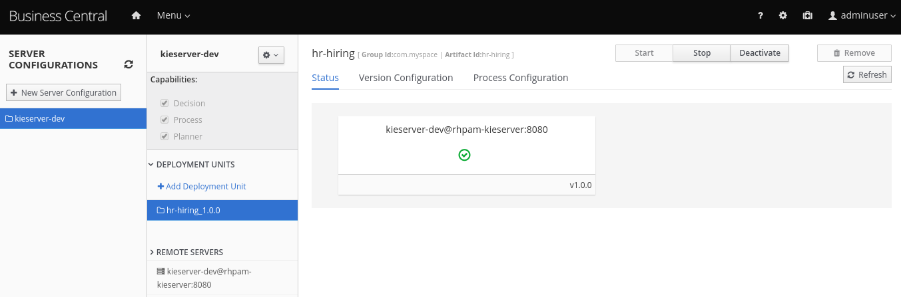
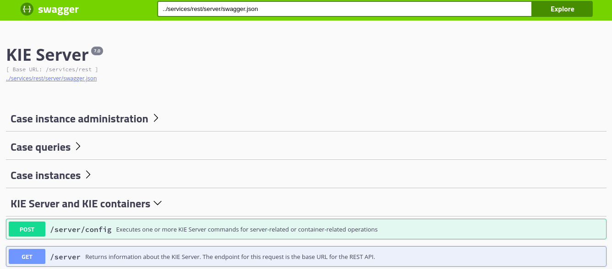
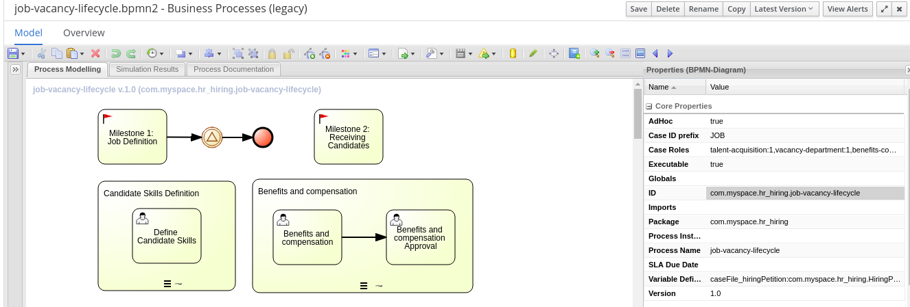
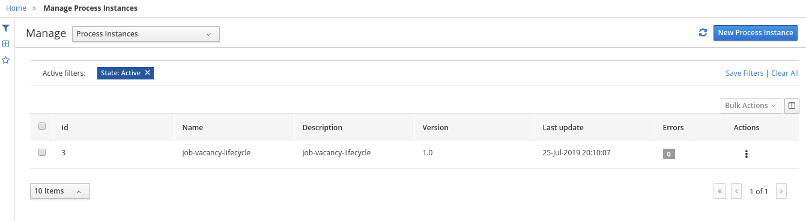
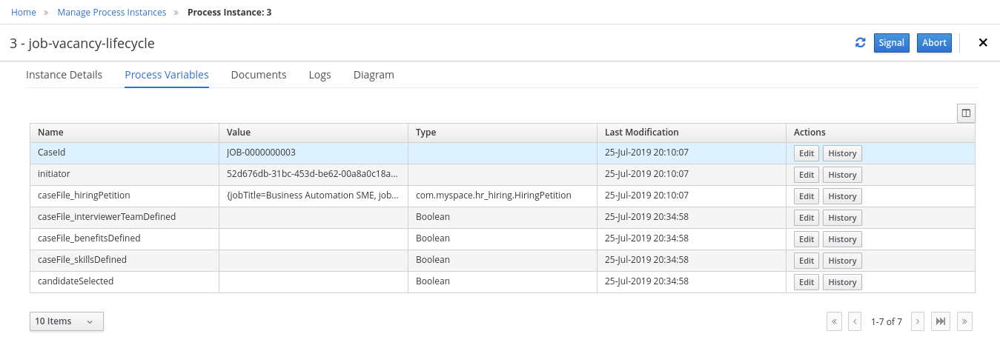

:noaudio:
:scrollbar:
:data-uri:
:toc2:
:linkattrs:

= Lab Setup

.Prerequisites
.. Module 01 Overview completion

:numbered:

== Overview

=== Background
The objective of this lab is to use the _dynamic case management_ capabilities of Red Hat's Process Automation Management (RH-PAM) product to represent an employee hiring business process. 

RH-PAM will be used to maintain the _wait state_ of the hiring processes and allow for in-flight changes to those processes.

Via the RESTful API exposed by RH-PAM, other services can change the state of the in-flight hiring business processes.
In particular, a *Case File* associated with the hiring process will be modified. 
The *Case File* holds information that affects the flow of execution, based in _milestones_ and _stages_.

Throughout this lab, pay attention to the conditions that trigger completions of the _milestones_ and _stages_ in the hiring process.
In particular, notice that these state changes are not as obvious as when depicted using conventional BPMN where the flow is strictly handled by the flow connectors
With a dynamic case management project, the flow of execution is changed by the data associated to the _Case File_.

=== Topology

image:images/managed-topology.png[Managed Topology Usage]

When we use Red Hat Process Automation Manager as a solution for authoring and hosting the services that empower case management we have the option to either go for an link:https://access.redhat.com/documentation/en-us/red_hat_process_automation_manager/7.4/html/managing_and_monitoring_process_server/kie-server-unmanaged-server-config-proc[un-managed] topology or a link:https://access.redhat.com/documentation/en-us/red_hat_process_automation_manager/7.4/html/managing_and_monitoring_process_server/kie-server-managed-kie-server-con[managed] topology.
In this workshop we will use a managed topology, this means that the Kie-server that works as a run-time server will request for its configuration to a controller. The Business Central will work as the controller for the Kie-server.
This topology also will facilitate our infrastructure with an authoring environment from which we will be able to analyze and change our case definition.

== Browse and Deploy project
In this section we will import the source code for the case management project into Business Central, and use Business Central to deploy the project to the kie-server run-time.
To execute this section you will need the Business Central Route. Retrieve the Business Central Route by entering by ssh protocol to the provisioned workstation in last lab, and running the following command:

----
$ echo -en "\n\nhttps://$bc_url/*\n\n"
----

=== Import and Browse the project contents

We will import the following project to our Business Central: https://github.com/barhte2019/hr-hiring

Red Hat Process Automation Manager uses git as source code repository. Each project in Business Central is also a git repository. When you create a new Project in Business Central you are creating also a git repository.
Git repositories can be imported to business central from remote repositories, but be aware that they don't keep their remote reference when you import them, instead they are copied to the Business Central's file system.
Business Central uses git file system to persist more than only the source code for your projects: All user preferences, configurations and any other internal information that Business Central requires to persist it will be persisted in git repositories; hence Business Central does not need a Database (DBMS), it will use the File System and git instead.

To import the repository in Business Central:

. Navigate to Business Central route.
. Login to Business Central using `adminuser/admin1!` credentials.

+
image:images/business-central-home.png[Business Central Home Page]

. Navigate to the `Design` page.
. As this will be our first project we will see an  in the home page of our `Design` option. Click this .

+
image:images/empty-projects-view.png[Empty projects view]

. Provide the following repository URL: https://github.com/barhte2019/hr-hiring.git and click *Import*

+
image:images/import-project.png[Import project window]

+
[NOTE]
====
When you need to import a *private* repository you can provide the credentials to authenticate with your git repository in the `advanced` section of the import pop-up.
====

. From the repository contents, Business Central will list the available kjar projects, in our case we only have 1 project; select this only project (hr-hiring), and click ok from the top right corner.

+
image:images/hr-hiring-project-select.png[Select project to import]

. Wait for the indexing process to finish

+
[NOTE]
====
The indexing process classifies our assets to be _Data Objects_, _Rules_, _Busines Processes_, etc., enabling easier search and organization of the project in Business Central.
====

=== Browse the project contents
The main assets that we will explore to understand how our project works are *Processes*, use the "Assets Type Drop-down" to select *Process* instead of *All*.

[NOTE]
====
For descriptive purposes I am naming here "Assets Type Drop-down" to the drop-down control in the top-left corner of the *Assets* tab in this Library Perspective.
Identify the control because initially it is selected as All:

image:images/assets-type-location.png[Assets Type Location]

You have more options to select here, at this point we are selecting *Process*

image:images/assets-type-options.png[Assets type options]

====

Let's start with the `job-vacancy-lifecycle` Business Process:

. Select the `job-vacancy-lifecycle` Business Process from the Library Assets.

+

. Once the process loads in the screen, from the right edge of the diagram, search for the  (Toggle Properties Button) so you can access the Case Diagram properties.

+
image:images/job-vacancy-lifecycle-properties.png[Job Vacancy Lifecycle Properties]

+
[NOTE]
====
When you click in any of the diagram elements you will see the properties of the selected element, if you click in the canvas you will see the diagram properties.
====

. Open the *Variable Definitions* drop-down from the *Core Properties*, the drop-down arrow will trigger a modal window with the list of available variables for the case definition. Notice that most of those variables are useful for the *Case File*, we only have 1 variable that is not used in the *Case File*, but it is used for the *Process Instance*.

+

. The *Case File* variable values can affect the activation of _milestones_ and _stages_. Identify the *Benefits and Compensation* stage, and look at its properties

+
image:images/benefits-compensation-props.png[Benefits and compensation properties]

. Notice the *AdhocActivationCondition* and the *AdhocCompletionCondition*

+
.AdhockActivationCondition
[source,java]
----
org.kie.api.runtime.process.CaseData(data.get("benefitsDefined") != true)
----

+
.AdhocCompletionCondition
[source,java]
----
org.kie.api.runtime.process.CaseData(data.get("benefitsDefined") == true)
----

. At any time during the life-cycle of a *Case Instance* that is based in this *Case Definition*, if some external or internal event changes the given values for this conditions to be met, the *Case Instance* will react to that information change and either activate or complete stages or milestones. Examine the _completion_ and _activation_ conditions of the remaining stages.

. _Milestones_ also have a condition that will cause the milestone to be *Achieved*. In order to see the condition for a _milestone_: Select the *Assignments* property of the milestone.

+
image:images/milestone-condition.png[Milestone condition]

Remember, any time you can change the values that cause those milestones and stages to be completed or activated, and when this completion or activation is triggered, the flow in the milestone or the stage is followed, in the next sections we will play with the data to cause different flows in the case instances.

. Close the `job-vacancy-lifecycle`
. Analyze the `hiring-case-definition` case diagram

+
image:images/hiring-case-definition.png[Hiring Case Definition]

=== Deploy the project to kie-server

Now is time to deploy our case management project to the kie-server run-time so we can start testing its functionality.

. Close any open assets (processes or classes that you were analizing)
. From the library view, locate the image:images/deploy-button.png[Deploy button]

+
image:images/deploy-button-location.png[Deploy button location]

. Click the image:images/deploy-button.png[Deploy Button] and wait for the *Success* message.

+

. Navigate to *Menu > Deploy > Execution Servers*

. Confirm that the deployment unit is in started (green) status

+

== Test the run-time
In this section we will use the kie-server run-time to interact with the project we had just deployed.
First we need the kie-server route, get the kie-server route from the openshift web console, under the RHPAM-dev project; or using the workstation ssh:

----
$ echo -en "\n\nhttps://$ks_url/\n\n"
----

The swagger API for kie-server provides endpoint test tools and some documentation about the different operations that can be performed in the kie-server run-time; including: Start Case Instances, Change data in the case instances and work in Human Tasks, among more operations regarding the engine, processes, rules, case managemet and more.

. Navigate to the kie-server route: `https://{route}/docs`, for instance: https://rhpam-kieserver-rhpam-dev-user1.apps-8735.generic.opentlc.com/docs

+
[NOTE]
====
In the example above I am using the route given by [green]#My current environment#, more likely your environment will change the ${GUID} (8735)
====

. In the Swagger API, locate the *KIE Server and KIE containers* section.

+

+
[NOTE]
====
Notice that you can fold or unfold the sections by clicking in their title.
====

. Use the [blue]#GET# button to open the testint tool for the */server* endpoint.

+
image:images/swagger-get-server.png[Swagger Get Server]

. Use the *Try it out* button in the top right *Parameters* header to have access to the *Parameters* and the *Execute* button.

+
image:images/try-out-get-server.png[Try it out - Get Server]

+
[NOTE]
====
The *GET /server* endpoint does not require any parameters, other operations require some information for the execution, some of those parameters will be optional and some required. In this case, because no parameters are expected to execute this operation we only see the *Execute* button.
====

. Click the *Execute* button to send the operation to the server. The server will process the parameters (if any), will execute the proper operation for the endpoint and come back with a result for us. In this case is the server status.

+
image:images/swagger-get-server-response.png[Swagger get server response]

+
[WARNING]
====
*Swagger not available in our Red Hat SSO Configuration.*
The current configuration of Red Hat SSO is not allowing authentication for the secured endpoints, take for instance the endpoint for starting case instances (*POST* endpoint for */server/containers/{containerId}/cases/{caseDefId}/instances*); if you try to execute this endpoint and give the proper parameters for execution you will see a Swagger response as `TypeError: Failed to fetch`.
Not to worry: we will use `curl` as a client to interact with the kie-server runtime, then we will observe how our ReactJs client applications also interact usin the REST APIs over HTTP.
====

=== Use curl client to interact with the case management project

In this section we will use the `curl` client. If you are using an OS-X is more likely that your laptop has the `curl` client, you can confirm its existence by executing a simple `curl` command:

----
$ curl https://httpstat.us/200
----

The response of the previous command is a simple:

----
200 OK
----

If you receive any other response, you can opt to use the workstation ssh, where the `curl` command is available.

==== Start a case instance

The endpoint to start a case instance is:

|===
|HTTP METHOD|ENDPOINT
|POST|/server/containers/{containerId}/cases/{caseDefId}/instances
|===

. Generate a token of authentication with Red Hat SSO: Remember that the kie-server is secured behind Red Hat SSO, if we want to consume secured operations (like starting a case instance), we are ought to generate a token first; then we will use that token in one of the request headers over HTTP. To generate an authentication token execute the following command (Pay attention to the rh_sso url, you must use your own):

+
----
$ RESULT=`curl -k --data "grant_type=password&client_id=kie-remote&username=adminuser&password=admin1%21" https://sso-rhsso-sso0.apps-8735.generic.opentlc.com/auth/realms/kie-realm/protocol/openid-connect/token`
$ echo $RESULT
----

+
[NOTE]
====
Note that we are "encoding" the exclamation mark for the password ( ! `is equivalent to` %21). Other characters in the password like ampersand (&) or at (@) should also be encoded if they are part of the password.
====

. As you can see, the `$RESULT` contains more than just the `token` that we need, so we are about to isolate that token from the response so we can use it:

+
----
$ TOKEN=`echo $RESULT | sed 's/.*access_token":"//g' | sed 's/".*//g'`
$ echo $TOKEN
----

+
[NOTE]
====
Tokens have an expiration date, if you provide a token that has expired you will get an `unauthorized` result from the API, when this happens, repeat the steps to generate a brand new token.
The expiration date for the tokens depends on the Red Hat SSO configuration, by default in our environment is *5 minutes*, you can change that in the *KIE-REALM* settings in Red Hat SSO.
====

. Now we can use the `token` to execute our endpoint in the kie-server url (Mind the kie-server url, use your own):

+
----
$ curl -k -H "Authorization: bearer $TOKEN" -H "content-type: application/json" -H "accept: application/json" https://rhpam-kieserver-rhpam-dev-user1.apps-8735.generic.opentlc.com/services/rest/server/containers/hr-hiring/cases/com.myspace.hr_hiring.job-vacancy-lifecycle/instances -d "{\"case-data\" : { \"hiringPetition\" : { \"jobTitle\": \"Business Automation SME\", \"jobDescription\": \"A nice job with a great company, are you ready for this challenge? This could be your next opportunity\", \"location\": \"remote Mexico\"} }, \"case-group-assignments\": { \"talent-acquisition\": \"talent-acquisition\", \"vacancy-department\": \"talent-acquisition\", \"benefits-compensation\": \"talent-acquisition\" }, \"case-user-assignments\" : { \"owner\" : \"adminUser\" }}"
----

+
[NOTE]
====
Note the replacement of the `{containerId}` and `{caseDefId}` parameters in the URL.

* For the `{containerId}` we can either use the deployment-unit *alias* or the *id*, this information can be retrieved from *Business Central*, under the *Menu > Deploy > Execution Servers*.

* For the `{caseDefId}` we use one of the properties of our case definition, if you look at the properties for the case definition that you want to create an instance from:

Notice that these *{containerId}* and *{caseDefId}* are bits of information that we want to keep handy for when we integrate our solution with external tools.
====

. The result of executing the `curl` command successfully you will see a Job Id like the following *"JOB-0000000001"*.

==== Confirm the current state of the case instance

. Using *Business Central* navigate to *Menu > Manage > Process Instances*, you will see 1 instance

+

. Click the existing process instance to see its details.

+
image:images/instance-details.png[Instance Details]

. In the *Process Variables* tab, confirm the *CaseId* to match the result from your `curl` command.

+

. In the *Diagram* tab notice that all milestones and stages for this case are enabled, some human tasks are also waiting for response (the ones highlighted in red). Once we complete some of these tasks you will see them in gray color (this means that they were executed), when they have a black border in colorful state that means that the given node has not been activated yet.

+
image:images/process-picture.png[Process Picture]

This REST API over HTTP is the approach that client applications use to communicate with our case management solution.
Red Hat Process Automation Manager is in charge of monitoring the state of the case instances, and our client applications can query RHPAM for any changes in the case file. Also, when the client applications report state changes to RHPAM, case instances react to those changes.
In the next labs we will interact with ReactJs applications that use this approach.
You can now proceed to the next lab.
