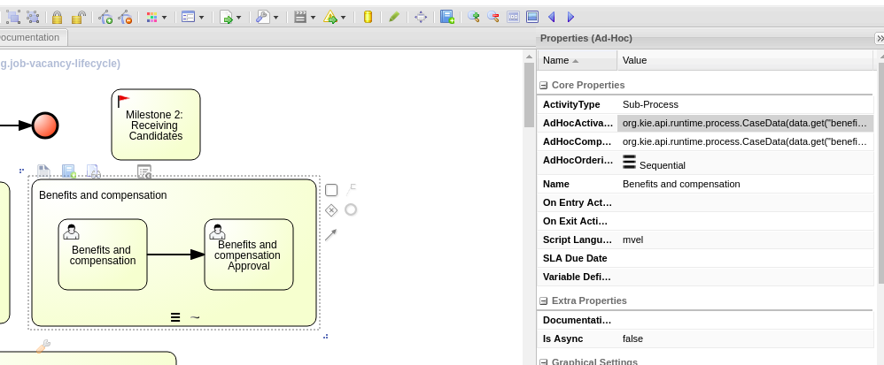
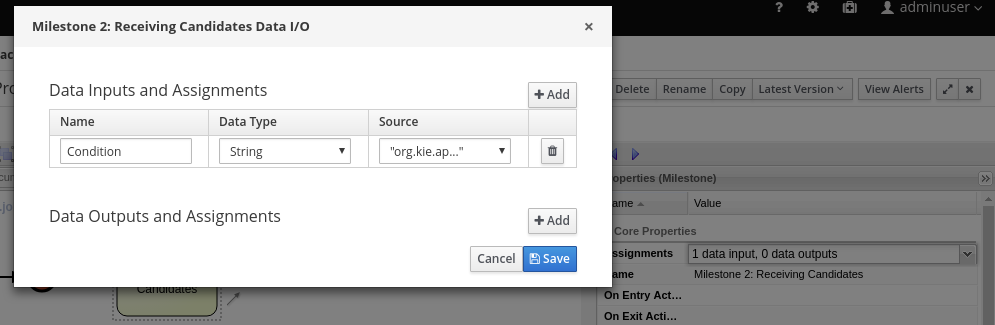

:noaudio:
:scrollbar:
:data-uri:
:toc2:
:linkattrs:

= Lab Setup

.Prerequisites
.. Module 01 Overview completion

:numbered:

== Overview
In this module we will import the case management project, analyze its contents and interact with the run-time using Business Central and the Kie-Server.

=== Background
The objective of the case management project is to depict the process that should be executed when launching a new hiring request. The more information we drive to the RH PAM engine, the best; we will avoid to use a database directly from the applications, centralizing the business rules, flows and data that drive the hiring process.
Any application that is integrated in the system will then have to use the case management project that we design to request and change information.
The data that is changed by different applications in our organization's portfolio will have an effect in the *Case File*. The *Case File* holds information that affects the flow of execution, based in _milestones_ and _stages_.
Pay attention to the conditions that trigger the _milestones_ and _stages_ completion, notice that is not as intuitive as if we were using a regular BPMN project, in which the flow is strictly handled by the flow connectors, in "case-management-land" the flow of execution is changed by the data that is received in the _Case File_.

=== Topology

image:images/managed-topology.png[Managed Topology Usage]

When we use Red Hat Process Automation Manager as a solution for authoring and hosting the services that empower case management we have the option to either go for an link:https://access.redhat.com/documentation/en-us/red_hat_process_automation_manager/7.4/html/managing_and_monitoring_process_server/kie-server-unmanaged-server-config-proc[un-managed] topology or a link:https://access.redhat.com/documentation/en-us/red_hat_process_automation_manager/7.4/html/managing_and_monitoring_process_server/kie-server-managed-kie-server-con[managed] topology.
In this workshop we will use a managed topology, this means that the Kie-server that works as a run-time server will request for its configuration to a controller. The Business Central will work as the controller for the Kie-server.
This topology also will facilitate our infrastructure with an authoring environment from which we will be able to analyze and change our case definition.

== Browse and Deploy project
In this section we will import the source code for the case management project into Business Central, and use Business Central to deploy the project to the kie-server run-time.
To execute this section you will need the Business Central Route. Retrieve the Business Central Route by entering by ssh protocol to the provisioned workstation in last lab, and running the following command:

----
$ echo -en "\n\nhttps://$bc_url/*\n\n"
----

=== Import and Browse the project contents

We will import the following project to our Business Central: https://github.com/barhte2019/hr-hiring

Red Hat Process Automation Manager uses git as source code repository. Each project in Business Central is also a git repository. When you create a new Project in Business Central you are creating also a git repository.
Git repositories can be imported to business central from remote repositories, but be aware that they don't keep their remote reference when you import them, instead they are copied to the Business Central's file system.
Business Central uses git file system to persist more than only the source code for your projects: All user preferences, configurations and any other internal information that Business Central requires to persist it will be persisted in git repositories; hence Business Central does not need a Database (DBMS), it will use the File System and git instead.

To import the repository in Business Central:

. Navigate to Business Central route.
. Login to Business Central using `adminuser/admin1!` credentials.

+

. Navigate to the `Design` page.
. As this will be our first project we will see an image:images/import-project-button.png[import project button] in the home page of our `Design` option. Click this image:images/import-project-button.png[import project button].

+
image:images/empty-projects-view.png[Empty projects view]

. Provide the following repository URL: https://github.com/barhte2019/hr-hiring.git and click *Import*

+
image:images/import-project.png[Import project window]

+
[NOTE]
====
When you need to import a *private* repository you can provide the credentials to authenticate with your git repository in the `advanced` section of the import pop-up.
====

. From the repository contents, Business Central will list the available kjar projects, in our case we only have 1 project; select this only project (hr-hiring), and click ok from the top right corner.

+
image:images/hr-hiring-project-select.png[Select project to import]

. Wait for the indexing process to finish

+
[NOTE]
====
The indexing process classifies our assets to be _Data Objects_, _Rules_, _Busines Processes_, etc., enabling easier search and organization of the project in Business Central.
====

=== Browse the project contents
The main assets that we will explore to understand how our project works are *Processes*, use the "Assets Type Drop-down" to select *Process* instead of *All*.

[NOTE]
====
For descriptive purposes I am naming here "Assets Type Drop-down" to the drop-down control in the top-left corner of the *Assets* tab in this Library Perspective.
Identify the control because initially it is selected as All:

You have more options to select here, at this point we are selecting *Process*

image:images/assets-type-options.png[Assets type options]

====

Let's start with the `job-vacancy-lifecycle` Business Process:

. Select the `job-vacancy-lifecycle` Business Process from the Library Assets.

+
image:images/hr-hiring-process-list.png[hr-hiring Process List]

. Once the process loads in the screen, from the right edge of the diagram, search for the image:images/toggle-properties-button.png[Toggle properties button] (Toggle Properties Button) so you can access the Case Diagram properties.

+
image:images/job-vacancy-lifecycle-properties.png[Job Vacancy Lifecycle Properties]

+
[NOTE]
====
When you click in any of the diagram elements you will see the properties of the selected element, if you click in the canvas you will see the diagram properties.
====

. Open the *Variable Definitions* drop-down from the *Core Properties*, the drop-down arrow will trigger a modal window with the list of available variables for the case definition. Notice that most of those variables are useful for the *Case File*, we only have 1 variable that is not used in the *Case File*, but it is used for the *Process Instance*.

+
image:images/job-vacancy-lifecycle-vardef.png[Case definition variables]

. The *Case File* variable values can affect the activation of _milestones_ and _stages_. Identify the *Benefits and Compensation* stage, and look at its properties

+

. Notice the *AdhocActivationCondition* and the *AdhocCompletionCondition*

+
.AdhockActivationCondition
[source,java]
----
org.kie.api.runtime.process.CaseData(data.get("benefitsDefined") != true)
----

+
.AdhocCompletionCondition
[source,java]
----
org.kie.api.runtime.process.CaseData(data.get("benefitsDefined") == true)
----

. At any time during the life-cycle of a *Case Instance* that is based in this *Case Definition*, if some external or internal event changes the given values for this conditions to be met, the *Case Instance* will react to that information change and either activate or complete stages or milestones. Examine the _completion_ and _activation_ conditions of the remaining stages.

. _Milestones_ also have a condition that will cause the milestone to be *Achieved*. In order to see the condition for a _milestone_: Select the *Assignments* property of the milestone.

+

Remember, any time you can change the values that cause those milestones and stages to be completed or activated, and when this completion or activation is triggered, the flow in the milestone or the stage is followed, in the next sections we will play with the data to cause different flows in the case instances.

. Close the `job-vacancy-lifecycle`
. Analyze the `hiring-case-definition` case diagram

+
image:images/hiring-case-definition.png[Hiring Case Definition]

=== Deploy the project to kie-server

Now is time to deploy our case management project to the kie-server run-time so we can start testing its functionality.

. Close any open assets (processes or classes that you were analizing)
. From the library view, locate the image:images/deploy-button.png[Deploy button]

+
image:images/deploy-button-location.png[Deploy button location]

. Click the image:images/deploy-button.png[Deploy Button] and wait for the *Success* message.

+
image:images/hr-hiring-deploy.png[HR Hiring Deploy Success]

. Navigate to *Menu > Deploy > Execution Servers*

. Confirm that the deployment unit is in started (green) status

+
image:images/hr-hiring-deployed.png[Hr-hiring deployed]

== Test the run-time
In this section we will use the kie-server run-time to interact with the project we had just deployed.
First we need the kie-server route, get the kie-server route from the openshift web console, under the RHPAM-dev project; or using the workstation ssh:

----
$ oc login https://master00.example.com -u user1 -p r3dh4t1!
$ oc project rhpam-dev-user1
$ oc get route | grep kieserver | awk '{print $2}'
----

=== Use Kie-Server swagger to interact with the case management project

The swagger API for kie-server provides endpoint test tools and some documentation about the different operations that can be performed in the kie-server run-time; including: Start Case Instances, Change data in the case instances and work in Human Tasks, among more operations regarding the engine, processes, rules, case managemet and more.

. Navigate to the kie-server route: `https://{route}/docs`, for instance: https://rhpam-kieserver-rhpam-dev-user1.apps-8735.generic.opentlc.com/docs

+
[NOTE]
====
In the example above I am using the route given by [green]#My current environment#, more likely your environment will change the ${GUID} (8735)
====

. In the Swagger API, locate the *KIE Server and KIE containers* section.

+
image:images/swagger-ks-containers.png[Swagger: kie-server containers]

+
[NOTE]
====
Notice that you can fold or unfold the sections by clicking in their title.
====

. Use the [blue]#GET# button to open the testint tool for the */server* endpoint.

+

. Use the *Try it out* button in the top right *Parameters* header to have access to the *Parameters* and the *Execute* button.

+

+
[NOTE]
====
The *GET /server* endpoint does not require any parameters, in the following steps we will use other endpoints that will require some information for the execution, some of those parameters will be optional and some required. In this case, because no parameters are expected to execute this operation we only see the *Execute* button.
====

. Click the *Execute* button to send the operation to the server. The server will process the parameters (if any), will execute the proper operation for the endpoint and come back with a result for us. In this case is the server status.

+
image:images/swagger-get-server-response.png[Swagger get server response]

==== Start a case instance for job-vacancy-lifecycle

. Using the kie-server Swagger API, locate the *POST* endpoint for */server/containers/{containerId}/cases/{caseDefId}/instances*. This endpoint is described as: "Starts a new case instance for a specified case definition".

+
image:images/swagger-start-case-instance.png[Start Case Instance Endpoint]

. Use the *Try it out* button to enable the parameters and *Execute* button.

+
image:images/swagger-start-case-instance-try-out.png[Start Case Instance Parameters]

. Fill up the parameters with the following values:

.. *containerId*: hr-hiring
.. *caseDefId*: `com.myspace.hr_hiring.job-vacancy-lifecycle`
.. *body*:

+
[source,json]
----
{
  "case-data" : {
    "hiringPetition" : {"jobTitle": "Javascript Frontend Developer", "jobDescription": "A nice job with a great company, are you ready for this challenge? This could be your next opportunity", "location": "remote Mexico"}
  },
  "case-group-assignments": { "talent-acquisition": "talent-acquisition" },
  "case-user-assignments" : { "owner" : "adminUser" }
}
----

+
[NOTE]
====
The case definition Id is retrieved from the case definition properties:

image:images/locate-definition-id.png[Case Definition Id]

The data and roles definition depends on the expected case variables and the available roles in the system.
====

==== Activate and deactivate milestones and stages.

=== Use curl client to interact with the case management project

=== Make a change and interact again with the case management project

== Use JUnit to test the data driven assets
