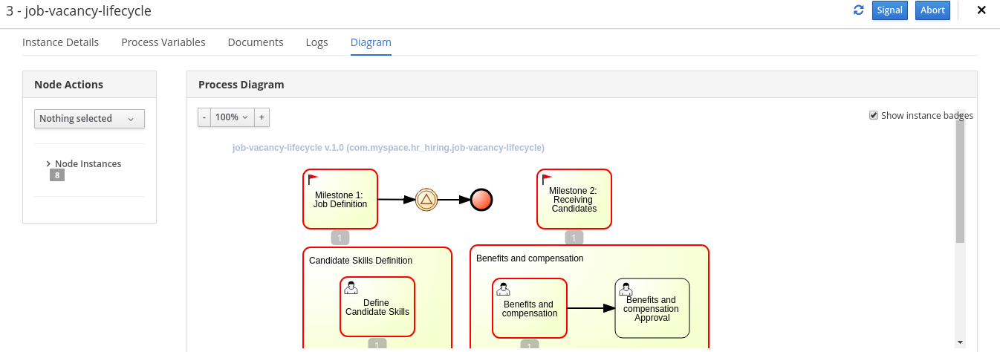

:noaudio:
:scrollbar:
:data-uri:
:toc2:
:linkattrs:

= Case Management Project Deployment

.Prerequisites
.. Module 01 Overview completion

:numbered:

== Overview

=== Background
The objective of this lab is to use the _dynamic case management_ capabilities of Red Hat's Process Automation Management (RH-PAM) product to manage an employee hiring business process.

RH-PAM will be used to maintain the _wait state_ of the hiring processes and allow for in-flight changes to those processes.

Via the RESTful API exposed by RH-PAM, other services can change the state of the in-flight hiring business processes.
In particular, a *Case File* associated with the hiring process will be modified.
The *Case File* holds information that affects the flow of execution, based in _milestones_ and _stages_.

Throughout this lab, pay attention to the conditions that trigger completions of the _milestones_ and _stages_ in the hiring process.
In particular, notice that these state changes are not as obvious as when depicted using conventional BPMN where the flow is strictly handled by the flow connectors
With a dynamic case management project, the flow of execution is changed by the data associated to the _Case File_.

=== Topology

RH-PAM offers both an link:https://access.redhat.com/documentation/en-us/red_hat_process_automation_manager/7.4/html/managing_and_monitoring_process_server/kie-server-unmanaged-server-config-proc[un-managed] topology and a link:https://access.redhat.com/documentation/en-us/red_hat_process_automation_manager/7.4/html/managing_and_monitoring_process_server/kie-server-managed-kie-server-con[managed] topology.
In this lab, you will use a _managed_ topology.
With a managed topology, the RH-PAM kie-server (which is the run-time server of the RH-PAM product)  will request its configuration from a controller.
The Business Central web application of the RH-PAM product will serve as this controller for the Kie-server.
This topology also will provide an authoring environment to analyze and change our case definition.

== Browse and Deploy project

=== Import and Browse the project contents

We will import the following project to our Business Central: https://github.com/barhte2019/hr-hiring

Red Hat Process Automation Manager uses git as source code repository.
Each project in Business Central (aka: kie-project) is also a git repository.
When you create a new Project in Business Central you are creating also a git repository.
Git repositories can be imported to business central from remote repositories
However, be aware that these imported repositories don't keep their remote reference.  Instead they are copied to the Business Central's file system.
Business Central uses git file system to persist more than only the source code for your projects: All user preferences, configurations and any other internal information that Business Central requires to persist it will be persisted in git repositories; hence Business Central does not need a Database (DBMS), it will use the File System and git instead.

To import the repository in Business Central:

. In your web browser, navigate to Business Central route (as you did in the previous lab).

. In Business Central, navigate to the `Design` page.

. As this will be our first project we will see an image:images/import-project-button.png[import project button] in the home page of our `Design` option. Click this image:images/import-project-button.png[import project button].
+

. Provide the following repository URL: https://github.com/barhte2019/hr-hiring.git and click *Import*
+

+
[NOTE]
====
When you need to import a *private* repository you can provide the credentials to authenticate with your git repository in the `advanced` section of the import pop-up.
====

. From the repository contents, Business Central will list the available _kjar_ projects
The _hr-hiring_ kie-project contains only have 1 project (called: hr-hiring); select this project and click ok from the top right corner.
+
image:images/hr-hiring-project-select.png[Select project to import]

. Wait for the indexing process to finish
+
[NOTE]
====
The indexing process enables quicker search of the various _Data Objects_, _Rules_ and _Business Processes_ of the newly imported kie-project.
====

=== Browse the project contents
The main assets to help better understand our business scenario are: *Processes*

. In the top-left corner of the `Assets` tab, select *Process*.
+
image:images/assets-type-options.png[Assets type options]

. Select the `job-vacancy-lifecycle` Business Process from the Library Assets.
+
image:images/hr-hiring-process-list.png[hr-hiring Process List]

. Once the process loads in the screen, from the right edge of the diagram, search for the image:images/toggle-properties-button.png[Toggle properties button] (Toggle Properties Button) so you can access the Case Diagram properties.
+
image:images/job-vacancy-lifecycle-properties.png[Job Vacancy Lifecycle Properties]
+
[NOTE]
====
When you click in any of the diagram elements you will see the properties of the selected element. If you click in the canvas you will see the diagram properties.
====

. Open the *Variable Definitions* drop-down from the *Core Properties*, the drop-down arrow will trigger a modal window with the list of available variables for the case definition. Notice that most of those variables are used for the *Case File*.  There is only 1 variable (_candidateSelected_) that is not used in the *Case File*, but it is used for the *Process Instance*.
+
image:images/job-vacancy-lifecycle-vardef.png[Case definition variables]

. The *Case File* variable values can affect the activation of _milestones_ and _stages_. Identify the *Benefits and Compensation* stage, and look at its properties
+
image:images/benefits-compensation-props.png[Benefits and compensation properties]

. Notice the *AdhocActivationCondition*
+
.AdhockActivationCondition
[source,java]
----
org.kie.api.runtime.process.CaseData(data.get("benefitsDefined") != true)
----

. At any time during the life-cycle of a *Case Instance* that is based on this *Case Definition*, if state changes of this Case Instance occur that result in one or more of its conditions to be met, the *Case Instance* will react to that information change and either activate or complete stages or milestones. Examine the _completion_ and _activation_ conditions of the remaining stages.

. _Milestones_ also have a condition that will cause the milestone to be *Achieved*. In order to see the condition for a _milestone_: Select the *Assignments* property of the milestone.
+
image:images/milestone-condition.png[Milestone condition]
+
Remember, any time you can change the values that cause those milestones and stages to be completed or activated, and when this completion or activation is triggered, the flow in the milestone or the stage is followed, in the next sections we will play with the data to cause different flows in the case instances.

. Close the `job-vacancy-lifecycle`
. Analyze the `hiring-case-definition` case diagram
+

=== Deploy the project to kie-server

In this section of the lab, you deploy the case management project to the kie-server run-time.

. Close any open assets (processes or classes that you were analyzing)
. From the library view, locate the 
+

. Click the  and wait for the *Success* message.
+
image:images/hr-hiring-deploy.png[HR Hiring Deploy Success]

. Navigate to *Menu > Deploy > Execution Servers*

. Confirm that the deployment unit is in started (green) status
+
image:images/hr-hiring-deployed.png[Hr-hiring deployed]

== Browse and test the run-time
In this section you will test the hiring application deployed to your kie-server run-time.

=== Browse KIE-Server RESTful endpoints

Your kie-server exposes an extensive RESTful API that external services can interact with.
This RESTful API is documented using the OpenAPI Specification.

In this section, you review this API documentation.

. Point your browser to the output of the following:
+
----
$ echo -en "\n\nhttps://$ks_url/docs\n\n"
----

. In this OpenAPI documentation, locate the *KIE Server and KIE containers* section.
+
image:images/swagger-ks-containers.png[Swagger: kie-server containers]
+
[NOTE]
====
Notice that you can fold or unfold the sections by clicking in their title.
====

. TO-DO: Provide a listing of the primary endpoints that will be invoked by external clients in this application.

. At this time, do not attempt to invoke any of the endpoints via this OpenAPI documentation:
+
The current configuration of Red Hat SSO is not allowing authentication for the secured endpoints
Take for instance the endpoint for starting case instances (*POST* endpoint for */server/containers/{containerId}/cases/{caseDefId}/instances*); if you try to execute this endpoint and give the proper parameters for execution you will see a Swagger response as `TypeError: Failed to fetch`.
+
As an alternative to using the OpenAPI documentation to test the hiring application, you will instead use `curl` in the next section of the lab.

=== Start a case instance

The endpoint to start a case instance is:

|===
|HTTP METHOD|ENDPOINT
|POST|/server/containers/{containerId}/cases/{caseDefId}/instances
|===

. Retrieve an OpenID Connect access token from Red Hat SSO using the pre-configured _kie-server_ SSO client.
+
----
RESULT=`curl -k --data "grant_type=password&client_id=kie-server&username=adminuser&password=admin1%21&client_secret=252793ed-7118-4ca8-8dab-5622fa97d892" https://$rhsso_url/auth/realms/kie-realm/protocol/openid-connect/token`
echo $RESULT
----
+
NOTE: The _kie-server_ SSO client can generate access tokens via the _Resource Owner Password Credentials_ flow of OpenID Connect.
For this reason, the userName and password of a end-user (called: _adminuser_) is included in this request.

. As you can see, the `$RESULT` contains more than just the `token` that we need, so we are about to isolate that token from the response so we can use it:
+
----
TOKEN=`echo $RESULT | sed 's/.*access_token":"//g' | sed 's/".*//g'`
echo $TOKEN
----
+
[NOTE]
====
Tokens have an expiration date, if you provide a token that has expired you will get an `unauthorized` result from the API, when this happens, repeat the steps to generate a brand new token.
The expiration date for the tokens depends on the Red Hat SSO configuration which by default is *5 minutes*.
====

. Now we can use the `token` to execute our endpoint in the kie-server url (Mind the kie-server url, use your own):
+
----
$ curl -k -H "Authorization: bearer $TOKEN" -H "content-type: application/json" -H "accept: application/json" https://$ks_url/services/rest/server/containers/hr-hiring/cases/com.myspace.hr_hiring.job-vacancy-lifecycle/instances -d "{\"case-data\" : { \"hiringPetition\" : { \"jobTitle\": \"Business Automation SME\", \"jobDescription\": \"A nice job with a great company, are you ready for this challenge? This could be your next opportunity\", \"location\": \"remote Mexico\", \"salaryMin\": 50000, \"salaryMax\": 60000, \"jobType\": \"Full Time\", \"jobCategory\": \"Operations\"} }, \"case-group-assignments\": { \"applicant\":\"applicant\", \"talent-acquisition\": \"talent-acquisition\", \"vacancy-department\": \"talent-acquisition\", \"benefits-compensation\": \"talent-acquisition\" }, \"case-user-assignments\" : { \"owner\" : \"tina\" }}"
----

.. Note the replacement of the `{containerId}` and `{caseDefId}` parameters in the URL.
*** For the `{containerId}` we can either use the deployment-unit *alias* or the *id*, this information can be retrieved from *Business Central*, under the *Menu > Deploy > Execution Servers*.
*** For the `{caseDefId}` we use one of the properties of our case definition, if you look at the properties for the case definition that you want to create an instance from:
+
image:images/locate-definition-id.png[Locate Definition Id]

.. The *{containerId}* and *{caseDefId}* are bits of information that we want to keep handy for when we integrate our solution with external tools.

. The result of executing the `curl` command successfully you will see a Job Id like the following *"JOB-0000000001"*.

==== Confirm the current state of the case instance

. Using *Business Central* navigate to *Menu > Manage > Process Instances*, you will see 1 instance
+
image:images/manage-process-instances.png[Manage Process Instances]

. Click the existing process instance to see its details.
+

. In the *Process Variables* tab, confirm the *CaseId* to match the result from your `curl` command.
+
image:images/process-variables.png[Process Variables]

. In the *Diagram* tab notice that all milestones and stages for this case are enabled, some human tasks are also waiting for response (the ones highlighted in red). Once we complete some of these tasks you will see them in gray color (this means that they were executed), when they have a black border in colorful state that means that the given node has not been activated yet.
+

This REST API over HTTP is the approach that client applications use to communicate with our case management solution.
Red Hat Process Automation Manager is in charge of monitoring the state of the case instances, and our client applications can query RHPAM for any changes in the case file. Also, when the client applications report state changes to RHPAM, case instances react to those changes.
In the next labs we will interact with ReactJs applications that use this approach.
You can now proceed to the next lab.
