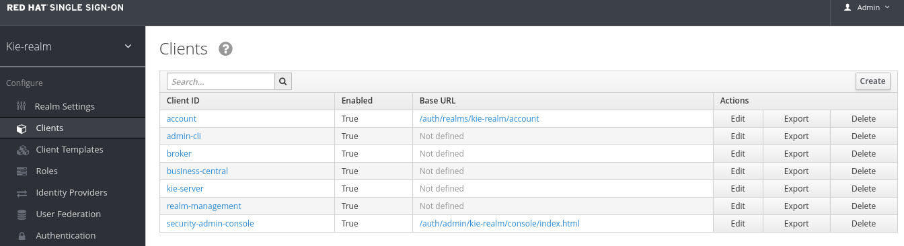

:noaudio:
:scrollbar:
:data-uri:
:toc2:
:linkattrs:

= Lab Setup

.Prerequisites
.. Module 01 Overview completion

:numbered:

== Overview
In this module we will create containers that host the client applications that will interact with the kie-server.

Client applications for this lab are ReactJs websites over a NodeJs server that interact with the kie-server deployed in Openshift during the previous lab.
To install the web sites be sure to have at reach:

* The *RH-SSO KIE-REALM* route.
* The *KIE-SERVER* route.

=== Background
Client applications interact with the Red Hat Process Automation Manager using REST API over HTTP. Other approaches also includes the interaction of client applications through Java API or Messaging Queues.
In this lab we will analyze an application that uses HTTP to interact with RHPAM; this application will help us understand how different client applications can be connected.
We had selected ReactJs as the javascript framework for this workshop, as you can see, given the flexibility of REST APIs, one can consume these services from a variety of different frameworks and clients.

=== Topology
In this lab we will build 2 javascript applications and will host them in a nginx server container. There will be a "Back Office" and a "Public" web application.

image:images/client-apps-topology.png[Client Apps Topology]

Web applications interact with the kie-server run-time using REST API over HTTP. For this purpose they will need to carry a token in the request header; Red Hat SSO will be used to request and renew the token.

== Import and Browse the project contents

In this section we will import and overview the contents of the client applications source code.
Then we will create a container with them and host the container in a new project in Openshift.

=== Import the client applications source code.

We will import the code from the following repositories:

* https://github.com/barhte2019/hiring-app-internal
* https://github.com/barhte2019/hiring-app-public

We will use `git clone` to import the repositories. It is recommended to use the `ssh workshop environment`, as it has all software required to execute the steps in the following sections. If you locally have `git` installed, you can perform the source code analysis locally.
For locally building the binary from source code (transpiling the ReactJs source code) you will need:

* NodeJs
* npm
* yarn
* A good internet band-with for downloading the dependencies.

If you either have installed these utilities in your local environment or are using the `ssh workshop environment`: import and build the client applications following these steps:

==== Import and build the client applications

. In the `ssh workshop terminal`, use the `$HOME/lab` directory

+
----
cd $HOME/lab
----

. Run the `git clone` command for importing the hiring-app-internal:

+
----
git clone https://github.com/barhte2019/hiring-app-internal.git
----

. Run the build commands inside of the newlly created directory (`$HOME/lab/hiring-app-internal`)

+
----
cd $HOME/lab/hiring-app-internal
yarn
yarn build
----

. Repeat the same steps, for the `hiring-app-public` application:

+
----
cd $HOME/lab
git clone https://github.com/barhte2019/hiring-app-public.git
cd $HOME/lab/hiring-app-public
yarn
yarn build
----

=== Create a RHSSO client

In this section we will prepare an authentication and authorization client in *Red Hat SSO* so we can authenticate using the same `realm` that we use to authenticate kie-server and business central RHPAM elements.

. Browse to *Red Hat SSO*, remember, from your `opentlc lab ssh` you can execute the following command to retrieve the *Red Hat SSO route*:

+
----
echo -en "\n\nhttps://$rhsso_url/auth/admin/kie-realm/console\n\n"
----

. Use the `admin/admin1234` credentials to authenticate into *Red Hat SSO*.

+
image:images/sso_login_home.png[SSO Login Home]

. Navigate to the *Clients* section, and click the  button in the top right corner of the Clients list.

+

. Set the name of the new client as `kie-remote` and *Save* it.

+
image:images/kie-remote-add.png[Add Kie-remote client]

. From the settings for the `kie-remote` client: [red]#Switch off# the *Standard Flow Enabled* and *Save* the changes.

+
image:images/kie-remote-standard-flow.png[Switch off standard flow]

. From the *Kie-remote* client settings, keep handy the *JSON* format for the *Installation Tab*, specially the *auth-server-url*, we will use it when installing the client applications.

+
image:images/kie-remote-json-installation.png[Kie Remote JSON installation format]

=== Create containers and upload them to OCP
In this section we will create Docker containers and push them to Openshift so we can create containers from them.
The ssh workstation has all the software components required for the following steps to work, if you want to execute this section locally you will need:

* *buildah*: for building an image.
* *OCP Client Utility*: (`oc`) for pushing the image to our openshift environment.
* A good internet band-width for uploading the image to Openshift.

To prepare for pushing these images to Openshift:

. Create a namespace in openshift to receive the images and create containers in it:

----
oc login https://master00.example.com -u user1 -p r3dh4t1!
oc new-project client-app
----

. Switch to openshift administrator access:

+
----
sudo -i
----

. Switch to the `default` project

+
----
oc project default
----

. Create an openshift route to the internal registry of your Openshift cluster

+
----
oc create route passthrough docker-registry-demo --service=docker-registry
----

. Setup an environment variable for the `docker-registry-demo` remote URL

+
----
export DOCKER_REGISTRY_HOSTNAME=$(oc get route docker-registry-demo -n default -o template --template='{{.spec.host}}')
----

. Use the `client-app` project

+
----
oc project client-app
----

. Create a pusher service account

+
----
oc create serviceaccount pusher
----

. Add `system:image-builder` and `edit` to `pusher` service account

+
----
oc policy add-role-to-user system:image-builder system:serviceaccount:client-app:pusher
oc policy add-role-to-user edit system:serviceaccount:client-app:pusher
----

. Exit the use of `root`

+
----
exit
----

==== The back office application
. Prepare the values that you will use in the client application configuration, take note (copy them to an available text editor so you can retrieve them in a later step) of the following variable values in the `workstation ssh`, we will use them in the next step:

+
----
echo -en "\n\nhttps://$rhsso_url/auth\n\n
echo -en "\n\nhttps://$ks_url\n\n
----

. Use the `workshop ssh` terminal to configure the environment variables inside the Dockerfile that will be used to build the `hiring-app-internal` image.

+
----
cd $HOME/lab/hiring-app-internal
vi Dockerfile
----

. Using the vi editor, set the proper values to the ENV values:

+
|===
|Get The Value From|Assign to ENV in file|Example
|`echo -en "\n\nhttps://$rhsso_url/auth\n\n"`| REACT_APP_RHSSO_URL |`ENV REACT_APP_RHSSO_URL=https://sso-rhsso-sso0.apps-af16.generic.opentlc.com/auth`
|`echo -en "\n\nhttps://$ks_url\n\n"`| REACT_APP_KIE_SERVER_URL |`ENV REACT_APP_KIE_SERVER_URL=https://rhpam-kieserver-rhpam-dev-user1.apps-af16.generic.opentlc.com`
|===

+
[NOTE]
====
`REACT_APP_RHSSO_REALM` and `REACT_APP_RHSSO_CLIENT` current values assume that you completed the creation of a Red Hat SSO client named as `kie-remote` in the `kie-realm`. If you perform a different operation in previous sections changing any of these names, please also perform the appropriate changes in the respective environment entry.
====

. Build the `hiring-app-internal` image using *buildah*:

+
----
cd $HOME/lab/hiring-app-internal
sudo buildah bud -t hiring-app-internal:1.0 .
----

. Get the token id for the `pusher` service account in openshift and save it in an environment variable.

+
----
export SA_TOKEN_ID=$(oc describe sa pusher -n client-app | grep Tokens | awk '{print $2}')
echo $SA_TOKEN_ID
----

. Discover the value of the `pusher` service account token and store that value in an environment variable

+
----
export SA_TOKEN=$(oc describe secret $SA_TOKEN_ID -n client-app | grep token: | awk '{print $2}')
echo $SA_TOKEN
----

. Push the image to the openshift registry

+
----
sudo buildah push --tls-verify=false --creds=pusher:$SA_TOKEN hiring-app-internal:1.0 docker-registry-demo-default.apps-8735.generic.opentlc.com/client-app/hiring-app-internal:1.0
----

. In openshift, create a container based in the pushed image.

+
----
oc new-app hiring-app-internal:1.0 -n client-app
----

. Expose the external route to be able to navigate to the `hiring-app-internal`

+
----
oc expose hiring-app-internal -n client-app
----

. Retrieve and navigate using a browser to the newly created back office web application.

+
----
oc get route -n client-app
----

. Login to the client application as *adminuser/admin1!*

. Congratulations you have installed the back office application.

==== The public web application
In this section you repeat almost the same steps than in previous section, to create a container based in the git repository for the `hiring-app-public`: https://github.com/barhte2019/hiring-app-public

. Prepare the values that you will use in the client application configuration, take note (copy them to an available text editor so you can retrieve them in a later step) of the following variable values in the `workstation ssh`, we will use them in the next step:

+
----
echo -en "\n\nhttps://$rhsso_url/auth\n\n
echo -en "\n\nhttps://$ks_url\n\n
----

. Use the `workshop ssh` terminal to configure the environment variables inside the Dockerfile that will be used to build the `hiring-app-internal` image.

+
----
cd $HOME/lab/hiring-app-public
vi Dockerfile
----

. Using the vi editor, set the proper values to the ENV values:

+
|===
|Get The Value From|Assign to ENV in file|Example
|`echo -en "\n\nhttps://$rhsso_url/auth\n\n"`| REACT_APP_RHSSO_URL |`ENV REACT_APP_RHSSO_URL=https://sso-rhsso-sso0.apps-af16.generic.opentlc.com/auth`
|`echo -en "\n\nhttps://$ks_url\n\n"`| REACT_APP_KIE_SERVER_URL |`ENV REACT_APP_KIE_SERVER_URL=https://rhpam-kieserver-rhpam-dev-user1.apps-af16.generic.opentlc.com`
|===

+
[NOTE]
====
`REACT_APP_RHSSO_REALM` and `REACT_APP_RHSSO_CLIENT` current values assume that you completed the creation of a Red Hat SSO client named as `kie-remote` in the `kie-realm`. If you perform a different operation in previous sections changing any of these names, please also perform the appropriate changes in the respective environment entry.
====

. Build the `hiring-app-public` image using *buildah*:

+
----
cd $HOME/lab/hiring-app-public
sudo buildah bud -t hiring-app-public:1.0 .
----

. Get the token id for the `pusher` service account in openshift and save it in an environment variable.

+
----
export SA_TOKEN_ID=$(oc describe sa pusher -n client-app | grep Tokens | awk '{print $2}')
echo $SA_TOKEN_ID
----

. Discover the value of the `pusher` service account token and store that value in an environment variable

+
----
export SA_TOKEN=$(oc describe secret $SA_TOKEN_ID -n client-app | grep token: | awk '{print $2}')
echo $SA_TOKEN
----

. Push the image to the openshift registry

+
----
sudo buildah push --tls-verify=false --creds=pusher:$SA_TOKEN hiring-app-public:1.0 docker-registry-demo-default.apps-8735.generic.opentlc.com/client-app/hiring-app-public:1.0
----

. In openshift, create a container based in the pushed image.

+
----
oc new-app hiring-app-public:1.0 -n client-app
----

. Expose the external route to be able to navigate to the `hiring-app-internal`

+
----
oc expose hiring-app-public -n client-app
----

. Retrieve and navigate using a browser to the newly created back office web application.

+
----
oc get route -n client-app
----

. Login to the client application as *bill/Password1!*

. Congratulations you have installed the public web application.
