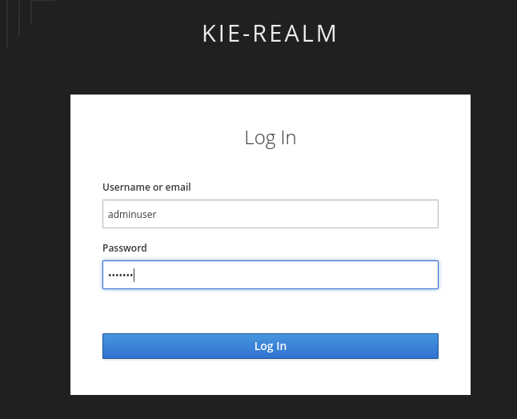
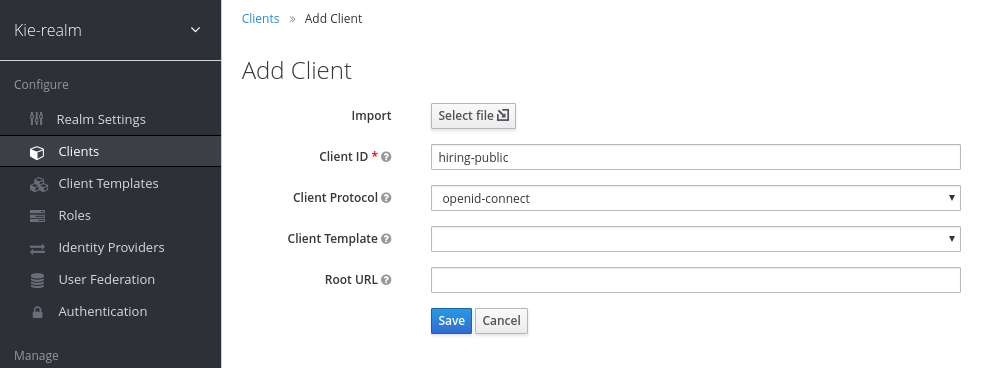

:noaudio:
:scrollbar:
:data-uri:
:toc2:
:linkattrs:

= Client Applications Deployment

:numbered:

== Overview
In this module you will deploy web applications that support a human reosurce department's _employee hiring_ business processes.

These web applications are built using _ReactJs_ and run in Linux container images layered with NodeJs.  They interact with the RESTful API of the RH-PAM kie-server.  Recall from the previous lab that the RESTful API of RH-PAM kie-server are secured using _OpenID Connect_.  Subsequently, these web applications will need to acquire an OIDC access token from RH-SSO and use this token to invoke the kie-server API.

=== Topology

image:images/client-apps-topology.png[Client Apps Topology]

As depicted in the diagram, 2 javascript web apps support the _employee hiring_ business processes:

* *Backoffice web app*
+
The _Backoffice_  web application allows a hiring manager to initiate a hiring request, define job requirements, review job statuses, and resolve tasks across the entire hiring process.

* *Public web app*
+
The _Public_ web application allows an applicant to search and apply for jobs and review a job application status.

== Deploy client applications to Openshift
In this section you deploy pre-built Linux container images of these two web applications to Openshift.

Client applications will be deployed to a new project in openshift: the `client-app` project.

. Create the `client-app` project in openshift:
+
----
oc login https://master00.example.com -u user1 -p r3dh4t1!
oc new-project client-app
----

=== The back office application
. Prepare the values that you will use in the client application configuration, take note (copy them to an available text editor so you can retrieve them in a later step) of the following variable values in the `workstation ssh`, we will use them in the next step:
+
----
echo -en "\n\nhttps://$rhsso_url/auth\n\n"
echo -en "\n\nhttps://$ks_url\n\n"
----

. Create a new OpenShift DeploymentConfiguration based on the link:https://quay.io/repository/rhtgptetraining/react-hiring-app-internal[react-hiring-app-internal] image.
+
----
oc new-app -n client-app quay.io/rhtgptetraining/react-hiring-app-internal:1.0 -e SSO_URL=https://$rhsso_url/auth -e KIE_URL=https://$ks_url
----

. Expose the external route to be able to navigate to the `react-hiring-app-internal`
+
----
oc expose svc/react-hiring-app-internal -n client-app --port=8080
----

=== The public web application
In this section, you create an OpenShift DeploymentConfiguration of the _Public_ web application.

. Create a new DeploymentConfiguration based on the link:https://quay.io/repository/rhtgptetraining/react-hiring-app-public[react-hiring-app-public] image.
+
----
oc new-app -n client-app quay.io/rhtgptetraining/react-hiring-app-public:1.0 -e SSO_URL=https://$rhsso_url/auth -e KIE_URL=https://$ks_url
----

. Expose the external route to be able to navigate to the `react-hiring-app-public`
+
----
oc expose svc/react-hiring-app-public -n client-app --port=8080
----

. Retrieve and navigate using a browser to the newly created back office web application.
+
----
oc get route -n client-app
----

== Create RH-SSO clients

In this section you create two additional _SSO clients_ in the existing _kie-realm_ of your *Red Hat SSO*.  The purpose of these two additional _SSO clients_ are to secure the two hiring related web applications.

. Navigate your browser to the _kie-realm_ of *Red Hat SSO* available at the following URL:
+
----
echo -en "\n\nhttps://$rhsso_url/auth/admin/kie-realm/console\n\n"
----

. Use the `admin/admin1234` credentials to authenticate into this SSO realm.
+
image:images/sso_login_home.png[SSO Login Home]

=== Back Office Application RH-SSO client.

. Navigate to the *Clients* section, and click the image:images/create-button.png[] button in the top right corner of the Clients list.
+
image:images/sso-clients-list.png[RH SSO initial clients list]

. Set the name of the new client as `hiring-internal`
+
image:images/hiring-internal-add.png[Add Kie-remote client]

. Set the *Root URL* of the `hiring-internal` as the route for the back office application:
+
----
echo http://$(oc get route -n client-app | grep internal | awk '{print $2}')
----
+
image:images/hiring-internal-add-root-url.png[Root URL for public client]

. *Save* the `hiring-internal` client.

When saving the `hiring-internal` client you will be able to login to the back office application.

. Navigate to the back office web application route, that you can retrieve from the `ssh console`:
+
----
echo http://$(oc get route -n client-app | grep internal | awk '{print $2}')
----

. From the *home screen* select the image:images/internal-login-button.png[Login Button]
+
image:images/hiring-internal-home.png[Hiring Internal Home]

. Log in to the internal Application using `adminuser/admin1!` credentials
+

. Congratulations! you had just installed and integrated the back office application with RH-PAM and RH-SSO.
+
image:images/hiring-internal-dashboard.png[Hiring internal dashboard]

=== Public Web Application RH-SSO client.

. Login to Red Hat SSO_URL
+
----
echo -en "\n\nhttps://$rhsso_url/auth/admin/kie-realm/console\n\n"
----

. Navigate to the *Clients* section, and click the image:images/create-button.png[] button in the top right corner of the Clients list.
+
image:images/sso-clients-list.png[RH SSO initial clients list]

. Set the name of the new client as `hiring-public`
+

. Set the *Root URL* of the `hiring-internal` as the route for the public web application:
+
----
echo http://$(oc get route -n client-app | grep public | awk '{print $2}')
----
+
image:images/hiring-public-add-root-url.png[Root URL for public client]

. *Save* the `hiring-public` client.

When saving the `hiring-public` client you will be able to login to the public web application.

. Navigate to the public web application route, that you can retrieve from the `ssh console`:
+
----
echo http://$(oc get route -n client-app | grep public | awk '{print $2}')
----

. From the *home screen* select the image:images/public-login-button.png[Login Button]
+
image:images/hiring-public-home.png[Public Hiring Home]

. Log in to the public web Application using `adminuser/admin1!` credentials
+

. Congratulations! you had just installed and integrated the back office application with RH-PAM and RH-SSO.
+
image:images/hiring-public-protected.png[Hiring public protected]
