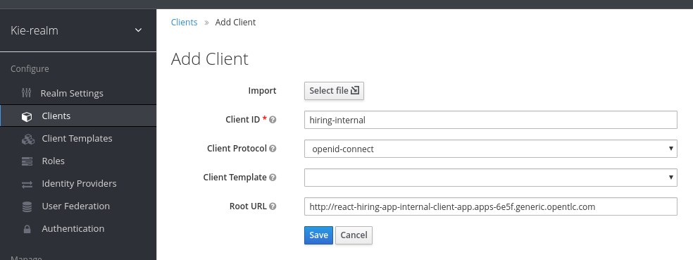
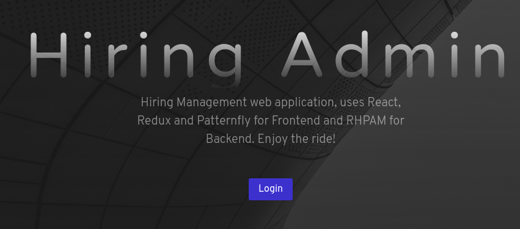
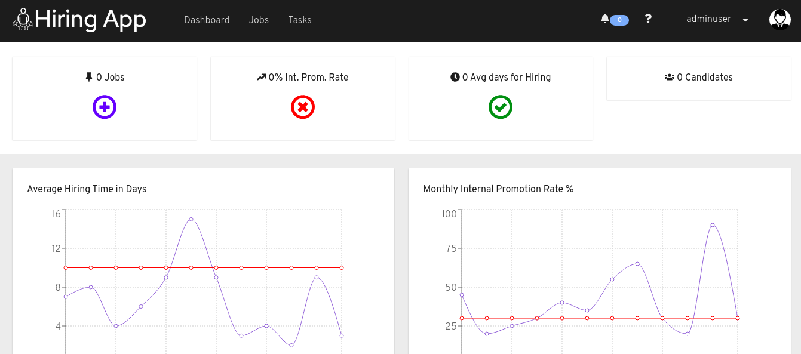
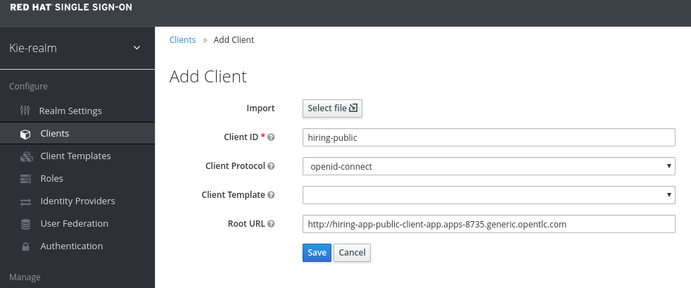

:noaudio:
:scrollbar:
:data-uri:
:toc2:
:linkattrs:

= _Hiring Request_ Web Applications

:numbered:

== Overview
In this module you will deploy web applications that support a human resource department's _employee hiring_ business processes.

These web applications are built using _ReactJs_ and run in Linux container images layered with NodeJs.  They interact with the RESTful API of the RH-PAM kie-server.  Recall from the previous lab that the RESTful API of RH-PAM kie-server are secured using _OpenID Connect_ (OIDC).  Subsequently, these web applications will need to acquire an OIDC access token from RH-SSO and use this token to invoke the kie-server API.

image:images/client-apps-topology.png[Client Apps Topology]

As depicted in the diagram, 2 javascript web apps support the _employee hiring_ business processes:

* *Backoffice web app*
+
The _Backoffice_  web application allows a hiring manager to initiate a hiring request, define job requirements, review job statuses, and resolve tasks across the entire hiring process.

* *Public web app*
+
The _Public_ web application allows an applicant to search and apply for jobs and review a job application status.

== Deploy Web Apps to Openshift
In this section you deploy pre-built Linux container images of these two web applications to Openshift.

Client applications will be deployed to a new project in openshift: the `client-app` project.

. Create the `client-app` project in openshift:
+
----
oc login https://master00.example.com -u user1 -p r3dh4t1!
oc new-project client-app
----

=== The back office application

. Create a new OpenShift DeploymentConfiguration based on the link:https://quay.io/repository/rhtgptetraining/react-hiring-app-internal[react-hiring-app-internal] image.
+
----
oc new-app quay.io/rhtgptetraining/react-hiring-app-internal:1.0 \
   -e SSO_URL=https://$rhsso_hostname/auth \
   -e SSO_REALM=kieRealm \
   -e KIE_URL=https://$ks_hostname \
   -n client-app
----

. Expose the external route to be able to navigate to the `react-hiring-app-internal`
+
----
oc expose svc/react-hiring-app-internal -n client-app --port=8080
----

=== The public web application
In this section, you create an OpenShift DeploymentConfiguration of the _Public_ web application.

. Create a new DeploymentConfiguration based on the link:https://quay.io/repository/rhtgptetraining/react-hiring-app-public[react-hiring-app-public] image.
+
----
oc new-app quay.io/rhtgptetraining/react-hiring-app-public:1.0 \
   -e SSO_URL=https://$rhsso_hostname/auth \
   -e SSO_REALM=kieRealm \
   -e KIE_URL=https://$ks_hostname \
   -n client-app
----

. Expose the external route to be able to navigate to the `react-hiring-app-public`
+
----
oc expose svc/react-hiring-app-public -n client-app --port=8080
----

== _Back Office_ Web App

In this section you create an additional _SSO client_ in the existing _kieRealm_ of your *Red Hat SSO*.  
The purpose of this additional _SSO client_ is to secure the _Back Office_ web applications.

=== RH-SSO _client_

. Be sure to log out from *Business Central*
+
[NOTE]
====
During the labs in this workshop is very probable that you will be using the same browser to perform different activities secured behind the same realm in *Red Hat SSO*, for purposes of sanitizing the OpenId web sessions you will be required to log out from previous applications before entering to another.
====

. Navigate your browser to the _kieRealm_ of *Red Hat SSO* available at the following URL:
+
----
echo -en "\n\nhttps://$rhsso_hostname/auth/admin/kieRealm/console\n\n"
----

. Use the `admin/admin1234` credentials to authenticate into this SSO realm.
+
image:images/sso_login_home.png[SSO Login Home]

. Navigate to the *Clients* section, and click the image:images/create-button.png[] button in the top right corner of the Clients list.
+
image:images/sso-clients-list.png[RH SSO initial clients list]

.. Set the name of the new client as `hiring-internal`

.. Set the *Root URL* of the `hiring-internal` as the route for the back office application:
+
----
echo http://$(oc get route -n client-app | grep internal | awk '{print $2}')
----
+

. *Save* the `hiring-internal` client.

Once the `hiring-internal` SSO client is saved, you will be able to authenticate into the _back office_ web application.

=== Browse _Back Office_ Web App
. Log out from *Red Hat SSO*

. Navigate to the back office web application route, that you can retrieve from the `ssh console`:
+
----
echo http://$(oc get route -n client-app | grep internal | awk '{print $2}')
----

. From the *home screen* select the 
+

. Log in to the internal Application using `adminuser/admin1!` credentials

. Congratulations! you have just installed and integrated the back office application with RH-PAM and RH-SSO. Be sure to log out from the back office application.
+

== Public Web Application 

=== RH-SSO client.

. Log out from the back office application.

. Login to Red Hat SSO_URL
+
----
echo -en "\n\nhttps://$rhsso_hostname/auth/admin/kieRealm/console\n\n"
----

. Navigate to the *Clients* section, and click the image:images/create-button.png[] button in the top right corner of the Clients list.
+
image:images/sso-clients-list.png[RH SSO initial clients list]

.. Set the name of the new client as `hiring-public`

.. Set the *Root URL* of the `hiring-public` as the route for the public web application:
+
----
echo http://$(oc get route -n client-app | grep public | awk '{print $2}')
----
+

. *Save* the `hiring-public` client.

=== Browse _Public_ Web App

. Log out from *Red Hat SSO*

. Navigate to the public web application route, that you can retrieve from the `ssh console`:
+
----
echo http://$(oc get route -n client-app | grep public | awk '{print $2}')
----

. From the *home screen* select the 
+

. Log in to the public web Application using `adminuser/admin1!` credentials

. Congratulations! you had just installed and integrated the public web application with RH-PAM and RH-SSO. Be sure to log out from the public web application.
+

