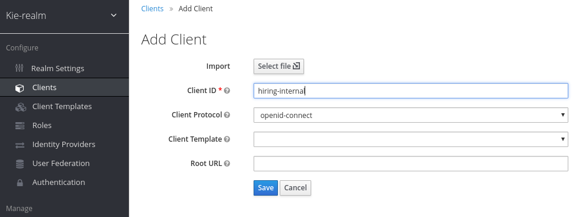

:noaudio:
:scrollbar:
:data-uri:
:toc2:
:linkattrs:

= Client Applications Deployment

.Prerequisites
.. Module 01 Overview completion

:numbered:

== Overview
In this module we will create containers that host the client applications that will interact with the kie-server.

Client applications for this lab are ReactJs websites over a NodeJs server that interact with the kie-server deployed in Openshift during the previous lab.
To install the web sites be sure to have at reach:

* The *RH-SSO KIE-REALM* route.
* The *KIE-SERVER* route.

=== Background
Client applications interact with the Red Hat Process Automation Manager using REST API over HTTP. Other approaches also includes the interaction of client applications through Java API or Messaging Queues.
In this lab we will analyze an application that uses HTTP to interact with RHPAM; this application will help us understand how different client applications can be connected.
We had selected ReactJs as the javascript framework for this workshop, as you can see, given the flexibility of REST APIs, one can consume these services from a variety of different frameworks and clients.

=== Topology
In this lab we will create OCP containers for 2 javascript applications. There will be a "Back Office" and a "Public" web application.

image:images/client-apps-topology.png[Client Apps Topology]

Web applications interact with the kie-server run-time using REST API over HTTP. For this purpose they will need to carry a token in the request header; Red Hat SSO will be used to request and renew the token (recall the `curl` command from previous lab).

== Deploy client applications to Openshift
In this section we will use pre-existing images in a public registry to deploy the client applications to openshift.

Client applications will be deployed to a new project in openshift: the `client-app` project.

. Create the `client-app` project in openshift:
+
----
oc login https://master00.example.com -u user1 -p r3dh4t1!
oc new-project client-app
----

=== The back office application
. Prepare the values that you will use in the client application configuration, take note (copy them to an available text editor so you can retrieve them in a later step) of the following variable values in the `workstation ssh`, we will use them in the next step:
+
----
echo -en "\n\nhttps://$rhsso_url/auth\n\n"
echo -en "\n\nhttps://$ks_url\n\n"
----

. Create a new container based in the link:https://quay.io/repository/rhtgptetraining/react-hiring-app-internal[react-hiring-app-internal] image.
+
----
oc new-app -n client-app quay.io/rhtgptetraining/react-hiring-app-internal:1.0 -e SSO_URL=https://sso-rhsso-sso0.apps-be98.generic.opentlc.com/auth -e KIE_URL=https://rhpam-kieserver-rhpam-dev-user1.apps-be98.generic.opentlc.com
----
+
[NOTE]
====
Mind the endpoints given to the `SSO_URL` and `KIE_URL` environment variables. You want to change the `${GUI_ID}` to your own. These values are taken from previous step.
====

. Expose the external route to be able to navigate to the `react-hiring-app-internal`
+
----
oc expose svc/react-hiring-app-internal -n client-app --port=8080
----

. Retrieve and navigate using a browser to the newly created back office web application.
+
----
oc get route -n client-app
----

. Take note of the route for the `react-hiring-app-internal` application, we will use it for the *Red Hat SSO* client configuration.

=== The public web application
In this section you repeat almost the same steps than in previous section, to create a container based in the link:https://quay.io/repository/rhtgptetraining/react-hiring-app-public[react-hiring-app-public] image.

. Create a new container based in the link:https://quay.io/repository/rhtgptetraining/react-hiring-app-public[react-hiring-app-public] image.
+
----
oc new-app -n client-app quay.io/rhtgptetraining/react-hiring-app-public:1.0 -e SSO_URL=https://sso-rhsso-sso0.apps-be98.generic.opentlc.com/auth -e KIE_URL=https://rhpam-kieserver-rhpam-dev-user1.apps-be98.generic.opentlc.com
----
+
[NOTE]
====
Mind the endpoints given to the `SSO_URL` and `KIE_URL` environment variables. You want to change the `${GUI_ID}` to your own. These values are taken from previous step.
====

. Expose the external route to be able to navigate to the `react-hiring-app-public`
+
----
oc expose svc/react-hiring-app-public -n client-app --port=8080
----

. Retrieve and navigate using a browser to the newly created back office web application.
+
----
oc get route -n client-app
----

. Take note of the route for the `react-hiring-app-public` application, we will use it for the *Red Hat SSO* client configuration.

== Create a RHSSO clients

In this section we will prepare two authentication and authorization clients in *Red Hat SSO* so we can authenticate using the same `realm` that we use to authenticate kie-server and business central RHPAM elements.

The main reason for doing this is the `Valid Redirect URIs` required for a Red Hat SSO Client configuration to allow certain applications to consume a _client_. We are allowed to use the same client for all of our applications, but is a good practice to keep them separated, in case you need a slight different configuration for a given application.

. Browse to *Red Hat SSO*, remember, from your `opentlc lab ssh` you can execute the following command to retrieve the *Red Hat SSO route*:
+
----
echo -en "\n\nhttps://$rhsso_url/auth/admin/kie-realm/console\n\n"
----

. Use the `admin/admin1234` credentials to authenticate into *Red Hat SSO*.
+
image:images/sso_login_home.png[SSO Login Home]

=== Back Office Application RH-SSO client.

. Navigate to the *Clients* section, and click the image:images/create-button.png[] button in the top right corner of the Clients list.
+
image:images/sso-clients-list.png[RH SSO initial clients list]

. Set the name of the new client as `hiring-internal`
+

. Set the *Root URL* of the `hiring-internal` as the route for the back office application:
+
----
echo http://$(oc get route -n client-app | grep internal | awk '{print $2}')
----
+
image:images/hiring-internal-add-root-url.png[Root URL for public client]

. *Save* the `hiring-internal` client.

When saving the `hiring-internal` client you will be able to login to the back office application.

. Navigate to the back office web application route, that you can retrieve from the `ssh console`:
+
----
echo http://$(oc get route -n client-app | grep internal | awk '{print $2}')
----

. From the *home screen* select the image:images/internal-login-button.png[Login Button]
+

. Log in to the internal Application using `adminuser/admin1!` credentials
+

. Congratulations! you had just installed and integrated the back office application with RH-PAM and RH-SSO.
+
image:images/hiring-internal-dashboard.png[Hiring internal dashboard]

=== Public Web Application RH-SSO client.

. Login to Red Hat SSO_URL
+
----
echo -en "\n\nhttps://$rhsso_url/auth/admin/kie-realm/console\n\n"
----

. Navigate to the *Clients* section, and click the image:images/create-button.png[] button in the top right corner of the Clients list.
+
image:images/sso-clients-list.png[RH SSO initial clients list]

. Set the name of the new client as `hiring-public`
+

. Set the *Root URL* of the `hiring-internal` as the route for the public web application:
+
----
echo http://$(oc get route -n client-app | grep public | awk '{print $2}')
----
+
image:images/hiring-public-add-root-url.png[Root URL for public client]

. *Save* the `hiring-public` client.

When saving the `hiring-public` client you will be able to login to the public web application.

. Navigate to the public web application route, that you can retrieve from the `ssh console`:
+
----
echo http://$(oc get route -n client-app | grep public | awk '{print $2}')
----

. From the *home screen* select the image:images/public-login-button.png[Login Button]
+

. Log in to the public web Application using `adminuser/admin1!` credentials
+

. Congratulations! you had just installed and integrated the back office application with RH-PAM and RH-SSO.
+
image:images/hiring-public-protected.png[Hiring public protected]
