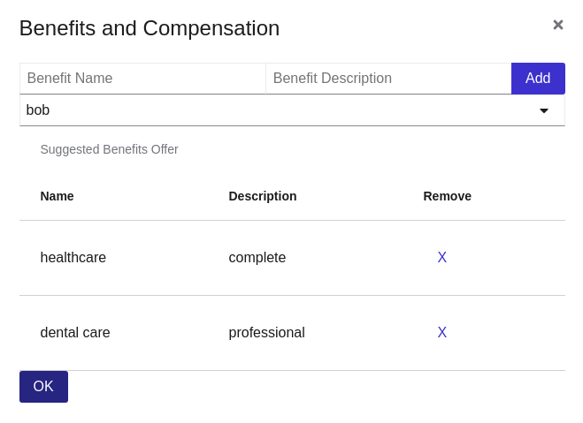

:noaudio:
:scrollbar:
:data-uri:
:toc2:
:linkattrs:

= End to End Case Mgmt Demo

:numbered:

== Overview
In this lab you execute the end-to-end cases for candidate selection and interviews in the hiring process.
You act as different administrative users and as an applicant to experiment with the usage of the platform.

=== Background
One of the departments in our organization wants to hire a new person.
Subsequently, that department raises a hiring petition which is evaluated for the candidate requisites, interviewer team and compensation.
Once the job details are defined, the job is automatically posted in the *JOB FINDER* web site so candidates can apply for jobs.
When a candidate applies, the interviewer team can be scheduled and candidate evaluation begins.
Once a candidate is selected a job offer is generated and the candidate can accept the job offer to complete the case management up to this point.

=== Case Management Diagrams

image::images/all_process.png[Hiring Case Diagram]

=== Available users
In *Red Hat SSO*, by navigating to the available users in the *kie-realm* realm, you can find the following users on behalf of which you will perform different actions in the end-to-end usage of the application:

[cols="1,1,5",options="header"]
|==============================
|Username|Password|Description
|adminuser|admin1!|Admin user assigned to the roles: Administrators, admin, kie-server, kiemgmt, rest-all
|Ava|Password1!|Ava is an out of the box applicant user type for our Hiring process. Ava is able to apply for jobs, she is not able to login to business central, but is able to login into the public client application.
|Bill|Password1!|Bill is an out of the box applicant user type for our Hiring process. Bill is able to apply for jobs, he is not able to login to business central, but is able to login into the public client application.
|Tina|Password1!|Tina is a `Talent-acquisition` user for our Hiring process. Tina is able to create hiring requests using the internal client application, although is not able to access business central.
|Tom|Password1!|Tom is a `Talent-acquisition` user for our Hiring process. Tom is able to create hiring requests using the internal client application, although is not able to access business central.
|Eve|Password1!|Eve is an `Interviewer` user for our hiring process. Eve is able to be assigned human tasks for interview and she is able to provide feedback, although is not able to login business central is able to login into the internal application to contribute in the interview process of the applicants.
|Ann|Password1!|Eve is an `Interviewer` user for our hiring process. Ann is able to be assigned human tasks for interview and she is able to provide feedback, although is not able to login business central is able to login into the internal application to contribute in the interview process of the applicants.
|Bob|Password1!|Eve is an `Interviewer` user for our hiring process. Bob is able to be assigned human tasks for interview and she is able to provide feedback, although is not able to login business central is able to login into the internal application to contribute in the interview process of the applicants.
|==============================

== Department request for jobs
Using the back office application (hiring_app_internal)

. Login as `Tina/Password1!` to the back office application (hiring-app-internal). To remember the route required to navigate to the back office application run the following command in the `ssh workstation`:
+
----
echo -en "\nhttp://$(oc get route -n client-app | grep internal | awk '{print $2}')\n"
----

. From the *Dashboard* web page, select the image:images/blue-plus-button.png[Blue plus button] button.

. Fill the *Add Job* form, they are text fields only, it is preferable that you fill all of them.
+
image:images/add-job-form.png[Add Job Form]

. Submit the form.

The form communicates with the kie-server using an api.js component in the source code: https://github.com/barhte2019/hiring-app-internal. If you are interested in a more detailed description on how this happens, refer to the Appendix in this lab.

== HR define job requirements
By creating a case instance in the previous section, 3 Human Tasks have been initiated that define the job requirement:

* Benefits and compensation: To be resolved by talent-acquisition
* Define Candidate Skills: To be resolved by talent-acquisition
* Interviewer team: To be resolved by an interviewer

Confirm the creation of those tasks by using the back office application and navigating to the *Tasks* menu, under the *Group Tasks* tab:

image:images/group-tasks.png[Group Tasks]

[CAUTION]
====
In your application, if you log in as *Tina*, you will see the 2 tasks to be resolved as a *talent-acquisition*, if you log in as *Bob* or *Ann*, you will see the *Interviewer team* task
====

The order in which you work in the tasks does not matter, in this section you will work in these 3 tasks and leave the case ready for candidates to apply for jobs.

=== Interviewer team task
. Log in into the `hiring-internal` application as *Ann / Password1!*
. From the *Group Tasks*, locate the *Interviewer Team* task name.

. Using the kebab menu, select the *claim* option.
+

. The previous step will make the *Interviewer Team* task available for the *User Tasks* tab, from the kebab menu of the *Interviewer Team*, select the *modify/complete* option.
+

. In the *Define Interviewer Team* emerging screen, type a couple names and a comment stating the skills they should validate.
+

. You will notice that the task is completed once you define the interviewer team and click *OK*.

=== Define Candidate skills
. Log in into the `hiring-internal` application as *Tina / Password1!*
. From the *Group Tasks*, locate the *Define Candidate Skills* task name.

. Using the kebab menu, select the *claim* option.
+

. The previous step will make the *Interviewer Team* task available for the *User Tasks* tab, from the kebab menu of the *Define Candidate Skills*, select the *modify/complete* option.
+

. In the *Define Candidate Skills form* emerging screen, type a couple skills with years of experience and knowledge level.
+

+
[NOTE]
====
There is a duplicate validation for the skill name.
====

. You will notice that the task is completed once you define the candidate skills and click *OK*.

=== Benefits and compensation
. Like in the previous steps, _claim_ and _modify/complete_ the *Benefits and compensation* task.
+
image:images/kebab-claimed-benefits.png[Modify Benefits Task]

. Define a few compensation benefits and select a manager to review the skills before making the job available to applicants. You will login as this manager in the next section and perform the benefits and compensation validation task.
+

=== Benefits and compensation approval
. Logout from the internal hiring application.

. Login back to the internal hiring application as the user you selected as the Benefits *manager*, (Bob in this example)

. You'll notice that in the *User Tasks* the *Benefits and compensation approval* task is available. Modify/complete the *Benefits and compensation approval task*. By completing this tasks, if the other tasks have been completed (Interviewer team definition and Candidate Skills), then the job will be published for candidates to apply.
+
image:images/benefits-approval.png[Benefits approval available]

== Candidate Apply for jobs

. Log out from the `hiring-internal` application.
+
[NOTE]
====
By having a session open in your browser for the RH-SSO client will prevent other application to log in in the same browser.
As the public hiring application uses the same RH-SSO instance, hence the need to log out first.
====

. Log in into the `hiring-public-application` using `Ava/Password1!` credentials.

. Click the  from the top banner.

. From the *Search Result*, click the job record or click the  from the *Features Job Method*, this will open the *application form*.

. Fill the skills information, note that the skills matrix is based in the skills defined for the job:
+

. Submit the job application and look at your application form status in the *My Applications* menu.

== The interview Process

. Log out from the `public-hiring` application.

. Log in into the `hiring-internal` application using `Tom/Password1!` credentials.

. From the *Task  > Group Tasks* section, claim the *Schedule Interviews*

. *Modify/complete* the *Schedule Interviews* task and enter a start time-slot and duration for each interviewer, for instance:
+

. Login to the `internal application` as the interviewers, and work in the *Interviewers Feedback* tasks, approving the candidate.
+
[NOTE]
====
You will need to log out and log in multiple times, depending on how many interviewers where defined during the *Interviewer team definition*

====

. Log in to the `internal application` as `Tina/Password1!`
+
[NOTE]
====
Tina was the person creating the job application, in the case of the CURL operation in lab 02, Tina was hard-coded as the *case-owner*
====

. Work in the *Interviewer Feedback Review*, accepting the candidate.
+

== Job offer acceptance

. Review the email simulator log at the `kie-server` pod generated by the interview tasks completion. The email nodes in this process are implemented by a Logger class called the "EmailSimulator". Emails, including the email sent for the job offer acceptance are in the kie-server log.
.. From the `ssh console`, execute the following command to have access to all emails simulated for the end to end case:
+
----
oc logs -c rhpam-kieserver `oc get pod -n $RHPAM_PROJECT | grep "rhpam-kieserver" | awk '{print $1}'` -n $RHPAM_PROJECT | grep MailSimulator
----

.. Expect to see entries for each email sent during the case, the following example shows the email sent for the job offer:
+
----
18:03:38,392 INFO  [com.myspace.hr_hiring.wih.MailSimulator] (Thread-15 (ActiveMQ-client-global-threads)) ******************** EMAIL SIMULATOR / *******************
18:03:38,392 INFO  [com.myspace.hr_hiring.wih.MailSimulator] (Thread-15 (ActiveMQ-client-global-threads)) From:joboffers@company.com
18:03:38,392 INFO  [com.myspace.hr_hiring.wih.MailSimulator] (Thread-15 (ActiveMQ-client-global-threads)) To: ava
18:03:38,393 INFO  [com.myspace.hr_hiring.wih.MailSimulator] (Thread-15 (ActiveMQ-client-global-threads)) Subject: Job offer review
18:03:38,393 INFO  [com.myspace.hr_hiring.wih.MailSimulator] (Thread-15 (ActiveMQ-client-global-threads)) --------------------------------------------
18:03:38,394 INFO  [com.myspace.hr_hiring.wih.MailSimulator] (Thread-15 (ActiveMQ-client-global-threads)) Please review the following job offer: http://document-storage/api/offers/APP-0000000010
18:03:38,394 INFO  [com.myspace.hr_hiring.wih.MailSimulator] (Thread-15 (ActiveMQ-client-global-threads)) --------------------------------------------
18:03:38,394 INFO  [com.myspace.hr_hiring.wih.MailSimulator] (Thread-15 (ActiveMQ-client-global-threads)) ******************** / EMAIL SIMULATOR  *******************
----

. Log out from the `internal hiring application`
. Login into the `public application` using `Ava/Password1!` credentials.

. Navigate to *My Applications* menu and *Accept* the job offer by clicking the application with *Waiting for your response* status.

This concludes the end-to-end demo of the application.

== Appendix

=== Optional:  Understand React to Kie-server interaction

. Open the source code for the hiring-internal-app: https://github.com/barhte2019/hiring-app-internal
+
[NOTE]
====
You have multiple options for this:

. You can navigate the source code in gitHub.

. In our previous lab we had cloned this repository to `$HOME/lab` directory in the `remote ssh workstation`, you can also explore the source code there.

. You can also download the source code from gitHub by cloning it to your local environment or by downloading a zip file from gitHub and decompresing it in your local machine. (Although I will strongly suggest this method, we should mind the current available bandwidth)

Im am using this option and navigating the source code using a local installation of link:https://code.visualstudio.com/download[VSCode], use your favorite method and editor.
====

. The `form submit` event can be found at link:https://github.com/barhte2019/hiring-app-internal/blob/master/src/jobs/add-job/index.tsx[`src/jobs/add-job/index.tsx`] you can notice that the form is using a class method `this.submit` at link:https://github.com/barhte2019/hiring-app-internal/blob/master/src/jobs/add-job/index.tsx#L79[line 79].
+
----
<Form ... onSubmit={this.submit}>
----

. The method `submit` from the `AddJobForm` class at link:https://github.com/barhte2019/hiring-app-internal/blob/master/src/jobs/add-job/index.tsx#L195[line 195], prevents default and sets the shared state for other components to take care of storing the data in the back end.
+
----
private submit = (event: React.FormEvent<HTMLFormElement>) => {
    event.preventDefault();
    this.props.onCreateJob(this.props.jobState.newJob);
}
----

. The `onCreateJob` method is injected by `react-redux connect`, this configuration is done at lines:
.. link:https://github.com/barhte2019/hiring-app-internal/blob/master/src/jobs/add-job/index.tsx#L3[line 3]: import `connect` from `react-redux`
.. link:https://github.com/barhte2019/hiring-app-internal/blob/master/src/jobs/add-job/index.tsx#L20[line 20]: import the `createJob` method definition (we will navigate to this definition later in this section), also observe its injection in link:https://github.com/barhte2019/hiring-app-internal/blob/master/src/jobs/add-job/index.tsx#L50[line 50].

. Find the implementation for the `onCreateJob` method at link:https://github.com/barhte2019/hiring-app-internal/blob/master/src/store/jobs/actions.ts#L147[`src/store/jobs/actions.ts`]
+
----
export function createJob(job: IJob) {
    return dispatch => {
        dispatch({ type: JOB_SUBMIT });
        return api.jobs.create(job).then(resp => {
            dispatch(push('/'));
            return dispatch({ type: JOB_CREATED, jobId: resp.data });
        }).catch(err => {
            return dispatch({ type: JOB_CREATED_ERROR, serverErrors: err })
        });
    }
}
----

. The `createJob` method makes use of the redux `dispatch` that invokes the `reducer` to change the state. For example, the reducer for `JOB_SUBMIT` can be found at link:https://github.com/barhte2019/hiring-app-internal/blob/master/src/store/jobs/reducers.ts#L124[`src/store/jobs/reducers.ts`]
+
----
...
case JOB_SUBMIT: {
   return {
       ...state,
       loading: true
   }
}
...
----

. In order to talk to the back end, the `onCreateJob` method defined in link:https://github.com/barhte2019/hiring-app-internal/blob/master/src/store/jobs/actions.ts#L150[`src/store/jobs/actions.ts`] uses the `api`. [red]#Api is a very relevant asset for the RHPAM configuration#
+
----
return api.jobs.create(job).then(...).catch(...)
----

. The `api` definition can be found at link:https://github.com/barhte2019/hiring-app-internal/blob/master/src/store/api.ts[`src/store/api.ts`]. Observe that every action that is requested to the API is built here. Information about the `Base URL`, formed with the *kie-server* URL and the `Token` for authentication and authorization with *Red Hat SSO* can be found around link:https://github.com/barhte2019/hiring-app-internal/blob/master/src/store/api.ts#L6[line 6], when defining the *Axios instance*. Then after link:https://github.com/barhte2019/hiring-app-internal/blob/master/src/store/api.ts#L36[line 36] we can find interactions and endpoints with the kie-server REST API.

. Find the API configuration for `jobs.create`

. The `hiring petition` reaches the configured *kie-server* and creates a *Case Instance* based in the received information.
