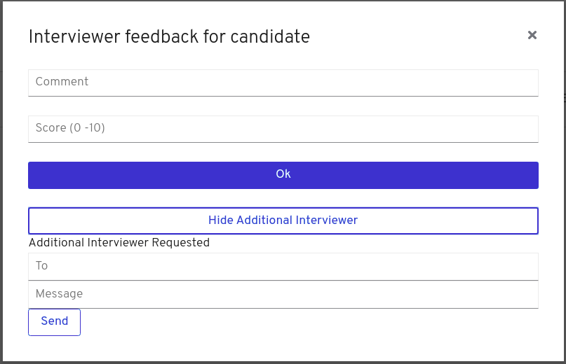

:noaudio:
:scrollbar:
:data-uri:
:toc2:
:linkattrs:

= Case Management Dynamic Tasks

:numbered:

== Overview
In this lab you will experiment with the dynamic tasks creation: An administrative user wants to create a Human Task that was not initially defined during the case design. Case Management is very flexible, it allows the knowledge worker to change the case usage during run time including: permissions, tasks, case information, documents and comments.

In this lab you will see the challenges and differences in creating dynamic tasks for stages and for the overall case; also you will analyze the javascript (ReactJs + Redux) integration code that makes dynamic tasks possible with the use of the kie-server REST API.

=== Background
During the interview process one of the interviewers detects that the applicant being interviewed can be a good fit for a different position, so asks another user to interview the candidate to confirm if this match is true; the other interviewer realizes that the applicant is a good fit and asks the applicant to apply for this different job detail.

Another possible scenario is that a manager needs to be notified about additional resources required for hiring the applicant, like when the applicant is worth to travel to a different location for interviewing.

=== Case Management Diagram

image::images/all_process.png[Case Diagram]

== Development environment preparation

In this section you will import the contents of the back office client application source code and will prepare the Openshift Registry to receive new images when the source code is modified and a new image created.

=== Import the back office client application source code.

You will import the code from the following repository:

* https://github.com/barhte2019/hiring-app-internal

You will use `git clone` to import the repository. It is recommended to use the `ssh workshop environment`, because it has `git` installed and in a later lab we will modify the source code and deploy our modification to Openshift. If you locally have `git` installed, you can perform the source code analysis locally.

. In the `ssh workshop terminal`, use the `$HOME/lab` directory
+
----
cd $HOME/lab
----

. Run the `git clone` command for importing the hiring-app-internal:
+
----
git clone https://github.com/barhte2019/hiring-app-internal.git
----

=== Prepare for Openshift Registry push operations

. Create a pusher service account in the client-app namespace
+
----
oc create serviceaccount pusher -n client-app
----

. Add `system:image-builder` and `edit` to `pusher` service account
+
----
oc policy add-role-to-user system:image-builder system:serviceaccount:client-app:pusher -n client-app
oc policy add-role-to-user edit system:serviceaccount:client-app:pusher -n client-app
----

. Patch the `react-hiring-app-internal` deployment config to be updated when a _latest_ image is found
+
----
oc patch dc react-hiring-app-internal --patch '{"spec": { "triggers": [ { "type": "ImageChange", "imageChangeParams": { "automatic": true, "containerNames": [ "react-hiring-app-internal" ], "from": { "kind": "ImageStreamTag", "namespace": "client-app", "name": "react-hiring-app-internal:latest"}}}]}}' -n client-app
----

== Change the UI for Dynamic tasks creation

In this section you will change the back office client application to create dynamic tasks using the kie-server REST API.
You can opt to use your local environment to make these changes, and you will need to find a way to have those changes reach the remote environment, here some options if you want to work locally:

* You can modify locally, and then upload to a public git repository (like gitHub). By doing this, in the later steps where you build a container based in your changes you will need to take care of pull/push activities.
* You can modify locally, and then upload through ssh to the remote ssh terminal. You can accomplish this with the `scp` tool.
* You can modify and build the image locally, this will require you to have locally a *buildah* or *podman* installation available in your machine. Later you will need to _push_ the modified image to the *Openshift Registry*

The following instructions will use the `vi` editor installed in the remote environment to modify the source code.

=== A version that creates dynamic tasks at the case level
In this section you will check out, analyze and implement a version of the `hiring-app-internal` client application that creates a dynamic task in the Case level.

. Check out the `dynamic_task` branch from git.
+
----
cd ~/lab/hiring-app-internal
git checkout dynamic_task
----

. Build the `hiring-app-internal` image using *buildah*:
+
----
cd $HOME/lab/hiring-app-internal
sudo buildah bud -t hiring-app-internal:1.1 .
----

. Get the token id for the `pusher` service account in openshift and save it in an environment variable.
+
----
export SA_TOKEN_ID=$(oc describe sa pusher -n client-app | grep Tokens | awk '{print $2}')
echo $SA_TOKEN_ID
----

. Discover the value of the `pusher` service account token and store that value in an environment variable
+
----
export SA_TOKEN=$(oc describe secret $SA_TOKEN_ID -n client-app | grep token: | awk '{print $2}')
echo $SA_TOKEN
----

. Push the image to the openshift registry
+
----
sudo buildah push --tls-verify=false --creds=pusher:$SA_TOKEN hiring-app-internal:1.1 $docker_registry/client-app/react-hiring-app-internal:1.1
----

. Tag the image as _latest_, so the deployment config is triggered and a new container created.
+
----
oc tag react-hiring-app-internal:1.1 react-hiring-app-internal:latest
----

. Wait for the pod to become available.
+
----
$ oc get pod -n client-app
NAME                                READY     STATUS    RESTARTS   AGE
react-hiring-app-internal-3-xdjpm   1/1       Running   0          44m
react-hiring-app-public-1-nbknr     1/1       Running   0          6h
----

. Login to the `hiring-internal` application with *Tina/Password1!* credentials.

. From the *Dashboard* page, create 1 job using the `blue plus button` under the jobs card.

. Claim the tasks to define candidate skills, benefits and interviewer teams. Remember than when defining benefits, you will need to select a manager to review the benefits; select *tom* as the manager. Also remember that defining interviewer teams needs to be done by a person that belongs to the interviewer group.

. Log out from the `hiring-internal`, and log back in with *Tom/Password1!* credentials.

. Approve the benefits for the job application. This action will make the job available for logged in users in the `hiring-public` application.

. Log out from the `hiring-internal` application.

. Log in into the `hiring-public` application with *Bill/Password1!* credentials.

. Apply for the new job as *Bill*

. Log out from the `hiring-public` application.

. Log in to the `hiring-internal` application as *Tom/Password1!* to schedule interviews for the applicants.

. Claim the *Schedule Interview* tasks, and provide time slots.

. Log out from the `hiring-internal` and log back in again, as an interviewer.

. Navigate to the *Tasks > User Tasks* section

. Select the *Modify/complete* option to access the *Interviewer Feedback* task form, click the *Show Additional Interviewer* button and review the newly created fields:
+

+
[CAUTION]
====
If you don't visualize your changes, be sure to refresh the browser's cache, this can be achieved by pressing [CTRL]+[F5] in your keyboard.
====

. In the *name* field for the *Additional Interviewer* task, type *bob* (lowercase)

. In the *message* field for the *Additional Interviewer* type the message for *bob* when he looks at the task, something like: *"I think this is a better prospect for other position"*

. Close the *Interviewer Feedback for Candidate* emerging window.

. Log out from the `hiring-internal-app` and log back in as *bob*

. Notice the creation of the Dynamic Task at the *Tasks > User Tasks* section. Identify the task by its *Task Name*: _Additional Interviewer_

Congratulations, you have created a dynamic task.

== Conclusion
During this lab you made a change in the client application that creates new human tasks that were not defined during the design of your case definition; this is a characteristic functionality of case management: that you can change the case behavior, flow, data and permissions of the running case "on-the-fly"; reactivate cases or complete them in advance. This is very different to the traditional BPMS approach where we are forced to flow with the process definition, now the things can fully depend on the hands of the knowledge worker and your application capabilities, being the responsibility of RHPAM to maintain the state and log of the multiple operations that where performed through the engine.

== A deeper analysis

Analyze the differences between the *master* branch and the *dynamic_task* branch at gitHub: https://github.com/barhte2019/hiring-app-internal/compare/dynamic_task; pay special attention to the API component that communicates with the *kie-server*: https://github.com/barhte2019/hiring-app-internal/compare/dynamic_task#diff-5630c403e26800aa6e1b0aeeb06a259b

=== ReactJS + Redux Challenge

As an *additional challenge*: Can you make an internal application app change that completes the newly created task?

=== Vanilla ReactJs Challence

Can you make the public application to show a progress dots status instead of the process map when click on the application *status* column

=== Case Management challenge

Instead of starting a dynamic task for defining the *Additional Interviewer*, how can you manage to design an ad-hoc task that is not automatically started, part of the "Applicant Review" stage, so this can only be started when requested and the stage can wait for its completion?

=== Fuse challenge

Currently the Fuse implementation only receives a text file content that will be stored at Swift; can you develop a route that receives parameters and builds the file by itself?
