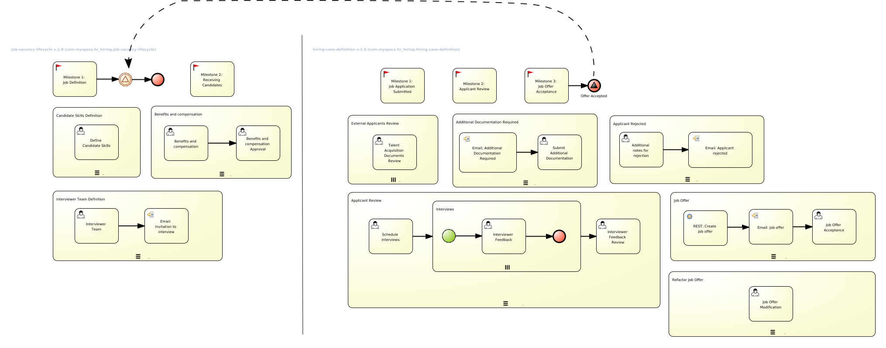

:noaudio:
:scrollbar:
:data-uri:
:toc2:
:linkattrs:

= Lab Setup

.Prerequisites
.. Execute Setup Lab.
.. Web browser installed on your laptop.
.. Broadband internet connectivity.
.. link:https://account.opentlc.com/account/[Red Hat GPTE _Opentlc_ userId]

:numbered:

== Overview
In this lab we will experiment with the dynamic tasks creation: An administrative user wants to create a Human Task that was not initially defined during the case design. Case Management is very flexible, it allows the knowledge worker to change the case usage during run time including: permissions, tasks, case information, documents and comments.

=== Background
During the interview process one of the interviewers detects that this user can be a good fit for a different position, so asks another user to interview the candidate; the new assigned group or user realizes that this is a good fit and changes the interviewer team and the job to which this user is applying to.

=== Case Management Diagram

== Change the UI for Dynamic tasks creation
=== The current UI analysis
=== Implementing and deploying the change
== Department request for jobs
== HR define job requirements
== Candidate Apply for jobs
== The interview Process
== Switching the candidate for another job
== The new interview process
== Job offer acceptance
