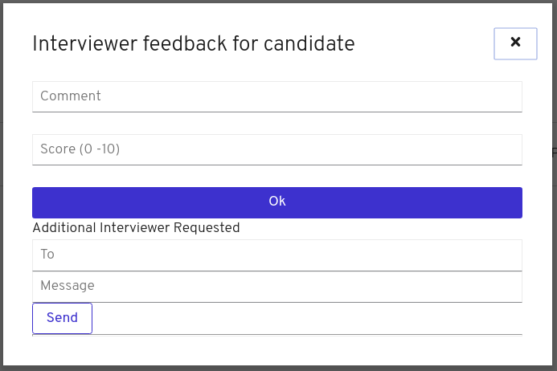

:noaudio:
:scrollbar:
:data-uri:
:toc2:
:linkattrs:

= Case Management Dynamic Tasks

.Prerequisites
.. Execute Setup Lab.
.. Web browser installed on your laptop.
.. Broadband internet connectivity.
.. link:https://account.opentlc.com/account/[Red Hat GPTE _Opentlc_ userId]

:numbered:

== Overview
In this lab you will experiment with the dynamic tasks creation: An administrative user wants to create a Human Task that was not initially defined during the case design. Case Management is very flexible, it allows the knowledge worker to change the case usage during run time including: permissions, tasks, case information, documents and comments.

=== Background
During the interview process one of the interviewers detects that this user can be a good fit for a different position, so asks another user to interview the candidate; the new assigned group or user realizes that this is a good fit and changes the interviewer team and the job to which this user is applying to.

=== Case Management Diagram

image::images/all_process.png[Case Diagram]

== Development environment preparation

In this section you will import the contents of the back office client application source code and will prepare the Openshift Registry to receive new images when the source code is modified and a new image created.

=== Import the back office client application source code.

You will import the code from the following repository:

* https://github.com/barhte2019/hiring-app-internal

You will use `git clone` to import the repository. It is recommended to use the `ssh workshop environment`, because it has `git` installed and in a later lab we will modify the source code and deploy our modification to Openshift. If you locally have `git` installed, you can perform the source code analysis locally.

. In the `ssh workshop terminal`, use the `$HOME/lab` directory
+
----
cd $HOME/lab
----

. Run the `git clone` command for importing the hiring-app-internal:
+
----
git clone https://github.com/barhte2019/hiring-app-internal.git
----

=== Prepare for Openshift Registry push operations

. Using the ssh terminal, switch to root user
+
----
sudo -i
----

. Create a pusher service account in the client-app namespace
+
----
oc create serviceaccount pusher -n client-app
----

. Add `system:image-builder` and `edit` to `pusher` service account
+
----
oc policy add-role-to-user system:image-builder system:serviceaccount:client-app:pusher -n client-app
oc policy add-role-to-user edit system:serviceaccount:client-app:pusher -n client-app
----

. Exit the root session at the ssh terminal
+
----
exit
----

. Patch the `react-hiring-app-internal` build config to be updated when a _latest_ image is found
+
----
oc patch dc react-hiring-app-internal --patch '{"spec": { "triggers": [ { "type": "ImageChange", "imageChangeParams": { "containerNames": [ "react-hiring-app-internal" ], "from": { "kind": "ImageStreamTag", "namespace": "react-hiring-app-internal", "name": "react-hiring-app-internal:latest"}}}]}}' -n client-app
----

=== Prepare a few jobs ready for interviews

As in this lab you want the interviewer to react to an applicant that might need an additional interviewer to validate for a different job opportunity, in this section you will generate 3 job requests, one of the job requests will hold the interviewing process for 2 applicants.

. Login to the `hiring-internal` application with *Tina/Password1!* credentials.
. From the *Dashboard* page, start 3 jobs using the `blue plus button` under the jobs card.
. Fill the form for each of the 3 jobs.
. Claim the tasks to define candidate skills, benefits and interviewer teams. Remember than when defining benefits, you will need to select a manager to review the benefits; select *tom* as the manager for the 3 of them.
. Log out from the `hiring-internal`, and log back in with *Tom/Password1!* credentials.
. Approve the benefits of the 3 job applications. This action will make the 3 jobs available for logged in users in the `hiring-public` application.
. Log out from the `hiring-internal` application.
. Log in into the `hiring-public` application with *Ava/Password1!* credentials.
. Apply for 2 jobs as *Ava*
. Log out from the `hiring-public` application and log back in with *Bill/Password1!* credentials.
. Apply for 2 jobs as *Bill*
. Log out from the `hiring-public` application.
. Log in to the `hiring-internal` application as *Tom/Password1!* to schedule interviews for the applicants.
. Claim the *Schedule Interview* tasks, and provide time slots, this will prepare different tasks with which we will be able to test our changes in the next sections.

== Change the UI for Dynamic tasks creation

In this section you will change the back office client application to create dynamic tasks using the kie-server REST API.
You can opt to use your local environment to make these changes, and you will need to find a way to have those changes reach the remote environment, here some options if you want to work locally:

* You can modify locally, and then upload to a public git repository (like gitHub). By doing this, in the later steps where you build a container based in your changes you will need to take care of pull/push activities.
* You can modify locally, and then upload through ssh to the remote ssh terminal. You can accomplish this with the `scp` tool.
* You can modify and build the image locally, this will require you to have locally a *buildah* or *podman* installation available in your machine. Later you will need to _push_ the modified image to the *Openshift Registry*

The following instructions will use the `vi` editor installed in the remote environment to modify the source code.

=== Add a `createDynamic` method to the `api.ts`

. Locate the `api.ts` component under `hiring-app-internal/src/store` directory:
+
----
$ cd ~/lab/hiring-app-internal/src/store
$ ls
api.ts  index.ts  jobs  system  tasks
----

. Open the `api.ts` component using `vi`
+
----
vi ~/lab/hiring-app-internal/src/store/api.ts
----

. In the `vi` editor, enable line numbers by typing the command [: set nu]
+

. Scroll to line 109 using [:109] vi command
+
image:images/vi_line_109.png[]

. after the `complete` function, but before the `detail` function, add a `createDynamic` method that uses the `/server/containers/{containerId}/cases/instances/{caseId}/tasks` *POST* endpoint from the kie_server.
+
----
createDynamic: (
     caseId: string,
     taskDescription: string,
     actor: string,
     data: any) => api().post(
     '/server/containers/hr-hiring/cases/instances/' + caseId + '/tasks',
     {
       actors: actor,
       data,
       description: 'Dynamic task created by system, looking for additional interviewer',
       groups: '',
       name: 'AdditionalInterviewer'
     }
   ),
----
+
[NOTE]
====
you can see the details of this service by navigating to:

----
$ echo https://$ks_url/docs
----

and searching for endpoints able to work with *dynamic* tasks.

====

. Exit the `vi` editor for `api.ts` by executing the vi command [:wq]

=== Add a form for Dynamic task to the `interviewer-feedback` component.

The component responsible for displaying and handling the *Interviewer Feedback* is located under the `~/lab/hiring-app-internal/src/components/interviewer-feedback` directory.

. Locate and open the `index.tsx` file under `~/lab/hiring-app-internal/src/components/interviewer-feedback` directory
+
----
vi ~/lab/hiring-app-internal/src/components/interviewer-feedback/index.tsx
----

. After line 50, modify the `Modal` content to add a `
` after the `</Form>` tag, the newly created `
` contains the *Additional Interviewer* fields definition:
+
----
  </Form>
  

    <h2>Additional Interviewer Requested</h2>
    <TextInput
        id="textInputDynamicTo"
        aria-label="Dynamic Task To"
        placeholder="To" />
    <TextInput
        id="textInputDynamicMessage"
        aria-label="Dynamic Task Message"
        placeholder="Message" />
    <Button className='pf-c-button pf-m-secondary'>Send</Button>
  

</Modal>)
----

. Save and close the `index.tsx` file; we will next build an image with this new Modal to visualize it.

=== Visualize the added fields (update the container)

In this section you create a Docker image and push it to Openshift so you can update the created container with its new version and visualize the changes.
The ssh workstation has all the software components required for the following steps to work, if you want to execute this section locally you will need:

* *buildah*: for building an image.
* *OCP Client Utility*: (`oc`) for pushing the image to our openshift environment.
* A good internet band-width for uploading the image to Openshift.

[NOTE]
====
In the following sections we will be making some changes, then creating a new container version based in a new image and continue with more changes, if you feel like just making changes with out checking the progress so often, you can opt to group some of the changes and create less images.
====

. Prepare the values that you will use in the client application configuration, take note (copy them to an available text editor so you can retrieve them in a later step) of the following variable values in the `workstation ssh`, we will use them in the next step:
+
----
echo -en "\n\nhttps://$rhsso_url/auth\n\n"
echo -en "\n\nhttps://$ks_url\n\n"
----

. Use the `workshop ssh` terminal to configure the environment variables inside the Dockerfile that will be used to build the `hiring-app-internal` image.
+
----
cd $HOME/lab/hiring-app-internal
vi Dockerfile
----

. Using the vi editor, set the proper values to the ENV values:
+
|===
|Get The Value From|Assign to ENV in file|Example
|`echo -en "\n\nhttps://$rhsso_url/auth\n\n"`| SSO_URL |`ENV SSO_URL=https://sso-rhsso-sso0.apps-af16.generic.opentlc.com/auth`
|`echo -en "\n\nhttps://$ks_url\n\n"`| KIE_URL |`ENV KIE_URL=https://rhpam-kieserver-rhpam-dev-user1.apps-af16.generic.opentlc.com`
|===
+
[NOTE]
====
`SSO_REALM` and `SSO_CLIENT` current values assume that you completed the creation of a Red Hat SSO client named as `hiring-internal` in the `kie-realm`.
====
+
TIP: Are these values required for the Dockerfile? May be not, these values are re-calculated by the environment variables of the generated container, but is good for you to know that they also exist during the image creation with their default values.

. Build the `hiring-app-internal` image using *buildah*:
+
----
cd $HOME/lab/hiring-app-internal
sudo buildah bud -t hiring-app-internal:1.1 .
----

. Get the token id for the `pusher` service account in openshift and save it in an environment variable.
+
----
export SA_TOKEN_ID=$(oc describe sa pusher -n client-app | grep Tokens | awk '{print $2}')
echo $SA_TOKEN_ID
----

. Discover the value of the `pusher` service account token and store that value in an environment variable
+
----
export SA_TOKEN=$(oc describe secret $SA_TOKEN_ID -n client-app | grep token: | awk '{print $2}')
echo $SA_TOKEN
----

. Push the image to the openshift registry
+
----
sudo buildah push --tls-verify=false --creds=pusher:$SA_TOKEN hiring-app-internal:1.1 $docker_registry/client-app/react-hiring-app-internal:1.1
----

. Tag the image as _latest_, so the build config is triggered and a new container created.
+
----
oc tag react-hiring-app-internal:1.1 react-hiring-app-internal:latest
----

. Wait for the pod to become available.
+
----
$ oc get pod -n client-app
NAME                                READY     STATUS    RESTARTS   AGE
react-hiring-app-internal-3-xdjpm   1/1       Running   0          44m
react-hiring-app-public-1-nbknr     1/1       Running   0          6h
----

. Login to the `internal-hiring-application` as *Bob/Password1!*
. Navigate to the *Tasks > User Tasks* section
. Select the *Modify/complete* option to access the *Interviewer Feedback* task form and review the newly created fields:
+

=== Toggle the Additional Interviewer fields

In this section you will hide/show the fields to define an additional interviewer. This requires interaction with the `state` of the `reactJs` component.
Modification of the `state` requires interaction with `actions` and `reducers`. For more information you can read: link:https://redux.js.org/basics/reducers[Redux Tutorial]

=== Capture state changes (from text fields)

=== Action for the `Send` button

=== Visualize the dynamic tasks

== Switching the candidate for another job
. Create a component to deal with the dynamic task
. Change the case-file data to change the jobRefId to another job

Congratulations, you have created a dynamic task. As an *additional challenge*: Can you make an internal application app change that completes the newly created task?
